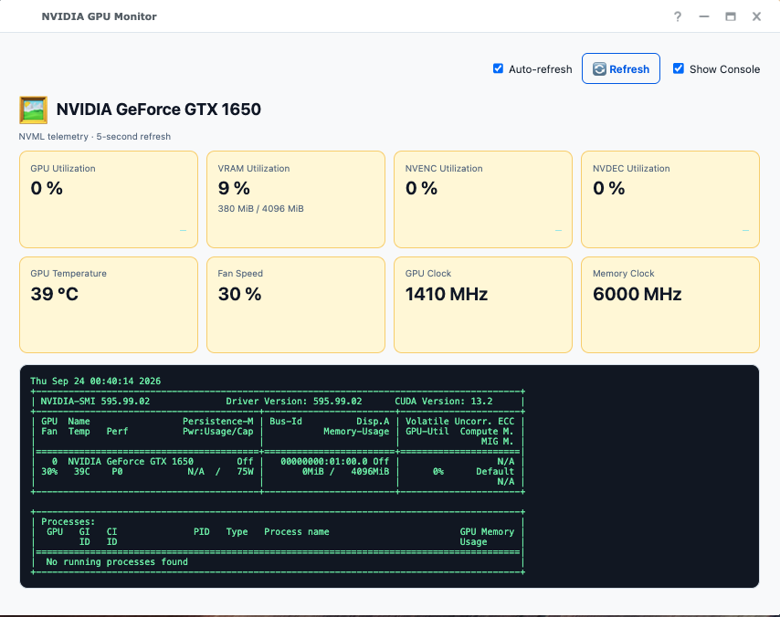
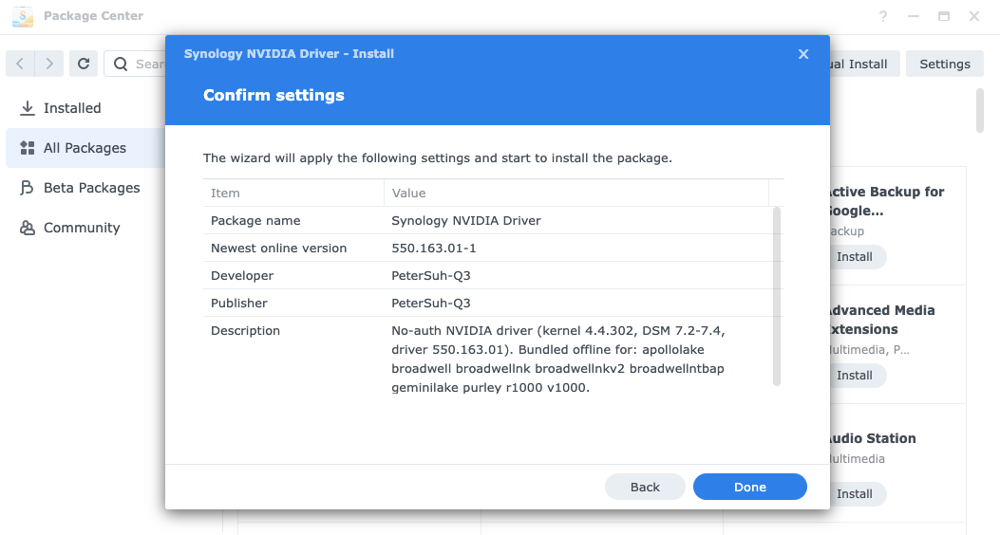
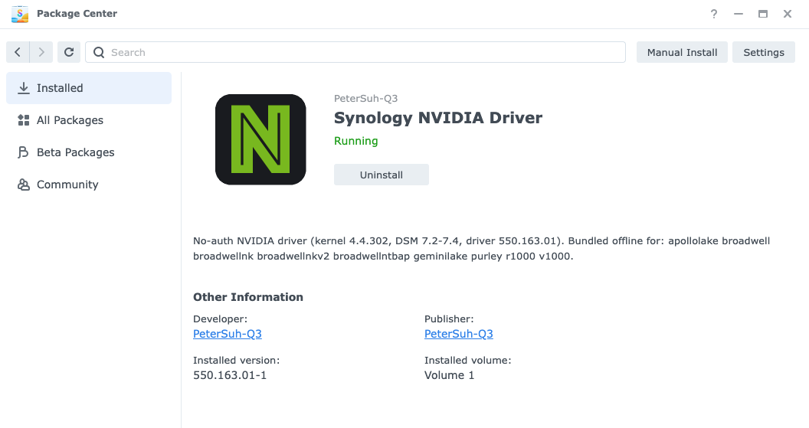
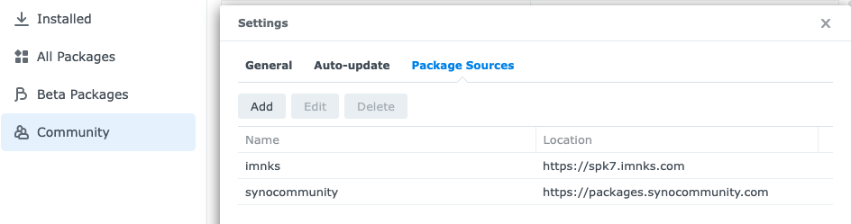
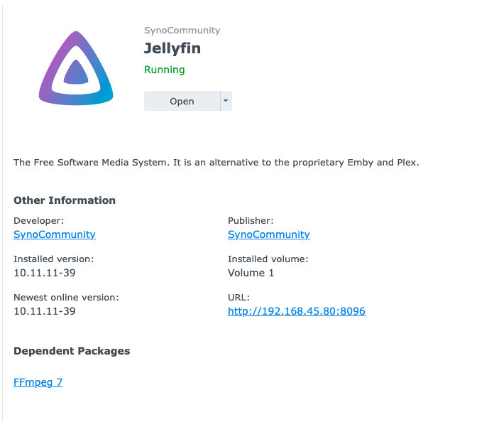
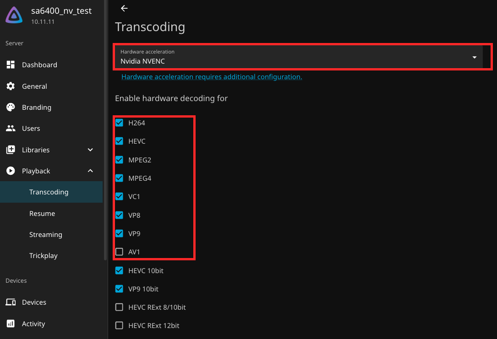
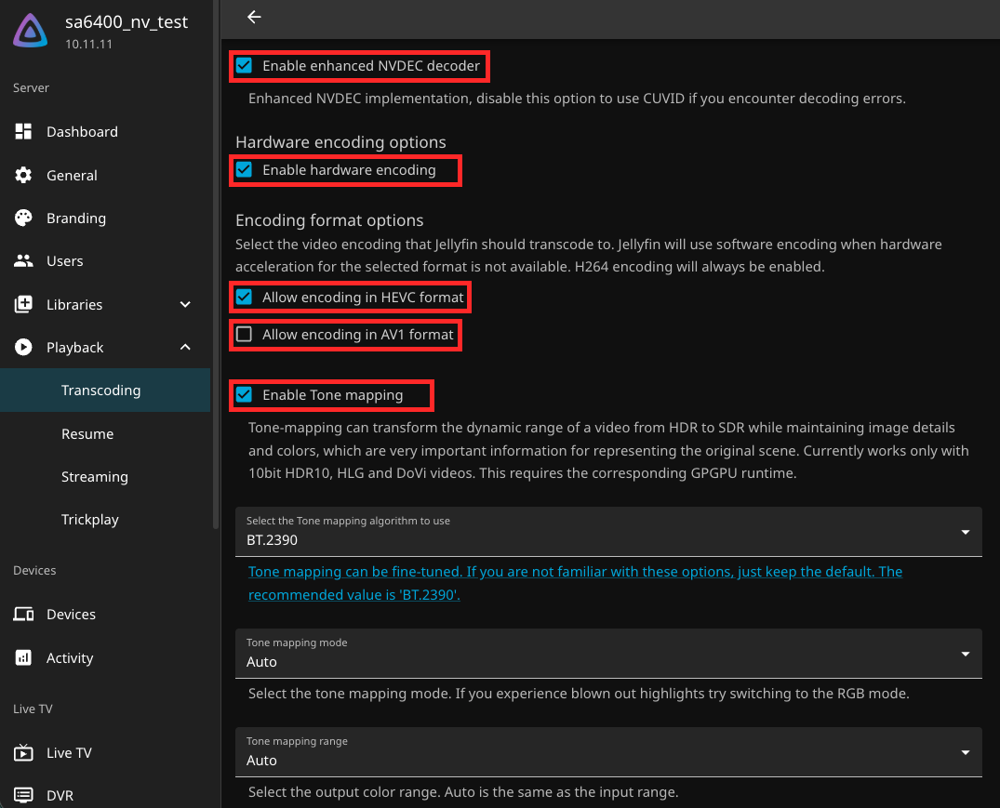
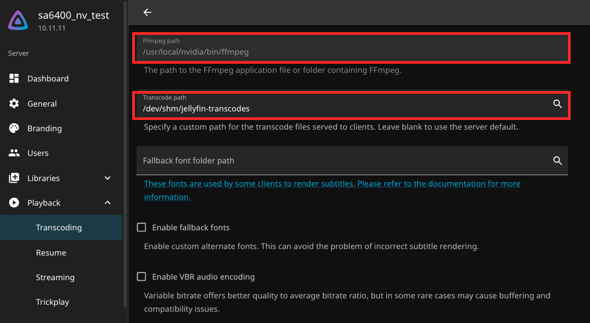
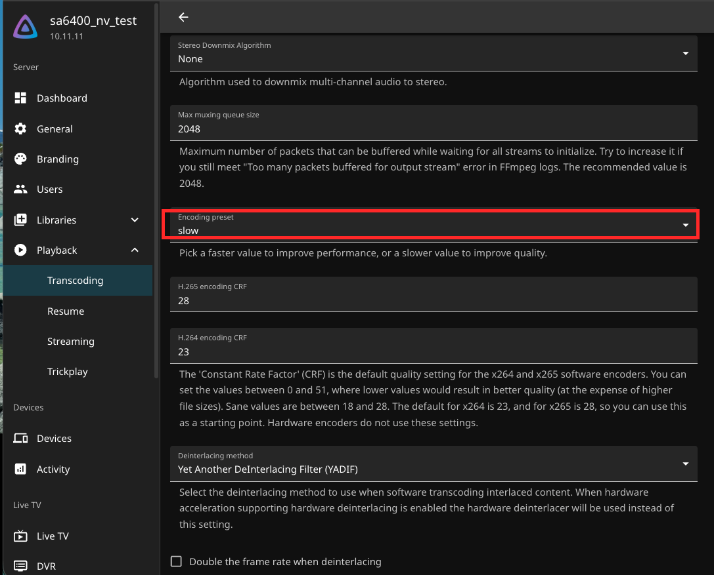

# syno_nvidia_driver

[](https://paypal.me/PeterSuhQ3)

<a href="https://github.com/PeterSuh-Q3/syno_nvidia_driver/releases"></a>

[](https://github.com/sponsors/PeterSuh-Q3)

**NVIDIA driver for Synology DSM — nothing to buy, nothing to sign in to (unlike vGPU).**

Physical / passthrough GPUs. One command installs it, survives reboots, and
enables hardware transcoding in Plex and Jellyfin.

## Synology NVIDIA GPU Monitor

The companion **Synology NVIDIA GPU Monitor** package provides a lightweight,
read-only floating dashboard for NVIDIA GPUs on DSM. It displays GPU and VRAM
utilization, NVENC/NVDEC activity, temperature, fan speed, and clock rates
using NVIDIA NVML. Install the SPK from the [0.6.2 release](https://github.com/PeterSuh-Q3/syno_nvidia_driver/releases/tag/0.6.2),
then launch it from the DSM main menu.

<p align="center">
  
</p>

<br>

> ⚠️ **Prefer the `.spk` package over the `curl | bash` installer below.**
>
> The one-line `install.sh` installer writes the full driver (kernel modules +
> userspace, ~450MB) to `/usr/local/nvidia`, which lives on your **system
> partition** (`/dev/md0`) — not your storage volume. On models with a small
> system partition this can eat most of the free space on its own (confirmed:
> [#7](https://github.com/PeterSuh-Q3/syno_nvidia_driver/issues/7)), and every
> future driver update means uninstalling and reinstalling that same 450MB.
>
> The `.spk` package installs through DSM's own Package Center mechanism
> instead. It's staged and stored entirely on your **data volume**
> (`/volume1/@appstore/...`) — confirmed via `synopkg`'s own install log — so
> it never touches system-partition space at all, and upgrades are handled
> the normal DSM way (no manual uninstall/reinstall cycle).
>
> Grab the right `.spk` for your platform and DSM version from the
> **[spk release](https://github.com/PeterSuh-Q3/syno_nvidia_driver/releases/tag/spk)**
> and install it via Package Center → Manual Install.
>
> <p align="center">
>   
>   
> </p>
>
> The `curl | bash` installer below still exists for platforms without a
> matching `.spk` build, or for scripted/headless setups — just be aware of
> the system-partition trade-off before reaching for it.

<br>

> 💡 **Why does that need saying?**
>
> The other way people get an NVIDIA GPU running on DSM goes through NVIDIA's
> **vGPU** stack — a paid, licensed product that needs a **license server** on
> your network, which the driver checks in with periodically to keep working.
> It exists so one physical GPU can be split across many virtual machines.
>
> **A NAS doing transcoding needs none of that.** This driver talks to the card
> directly, exactly the way a normal Linux desktop does. No license, no server,
> no account. The trade-off is that you can't partition the GPU across VMs —
> which is not something home users do.

<br>

---

<br>

## 🚀 Install

```bash
curl -sL https://github.com/PeterSuh-Q3/syno_nvidia_driver/releases/download/nvidia/install.sh | sudo bash
```

That's it. The installer detects your platform and GPU, picks the right driver,
and refuses to run on anything it can't support.

<p align="center">
  
</p>

<br>

> ### ⚠️ Restart Plex / Jellyfin afterwards
>
> ```bash
> sudo /usr/syno/bin/synopkg restart PlexMediaServer
> ```
>
> They scan for GPUs **once at startup** and cache the result. If the package was
> already running when you installed the driver, the GPU will simply not appear
> in its settings.
>
> **This is by far the most common "driver installed but transcoding doesn't
> work" cause** — not a CUDA or driver mismatch.

<br>

**Requirements** — root/`sudo`, internet, an NVIDIA GPU, and a supported
platform ([see the matrix](#-supported-platforms)).

A boot hook (`/usr/local/etc/rc.d/nvidia.sh`) is installed automatically, so the
driver reloads after every reboot.

<br>

---

<br>

## ✅ Verify

```bash
nvidia-smi
sudo ls -l /dev/nvidia*
```

<p align="center">
  
</p>

A healthy install has **one `/dev/nvidia<N>` per physical GPU**, plus
`nvidiactl` and `nvidia-uvm`. If `nvidia-smi` works but CUDA apps fail, check
that `nvidia_uvm` is in `lsmod`.

<details>
<summary><b>Device node reference</b> — what each node is for</summary>

<br>

| Node | Major | What it is |
|---|:---:|---|
| `/dev/nvidia0` | 195 | The GPU itself — **one node per physical GPU**. A second card appears as `nvidia1`. |
| `/dev/nvidiactl` | 195 | Driver control node; every client opens this first. |
| `/dev/nvidia-uvm` | 240 | Unified memory — **CUDA will not work without it**. |
| `/dev/nvidia-uvm-tools` | 240 | Debug/profiling companion to UVM. |
| `/dev/nvidia-caps/*` | 243 | MIG capability nodes; unused outside datacenter GPUs. |
| `/dev/nvidia-modeset` | 195 | Mode-setting node. |

Permissions are `crw-rw-rw-`, so unprivileged package users (Plex, Jellyfin,
containers) can open them with no extra setup.

If the nodes are missing entirely, the modules did not load — re-run the
installer or check `dmesg | grep -i nvrm`.

</details>

<details>
<summary><b>❓ <code>/dev/dri</code> is missing — is that a problem?</b></summary>

<br>

**No.** On headless platforms it cannot exist, and nothing you install will
change that. Synology builds no DRM subsystem on server platforms
(`epyc7002`, `epyc7003`, `icelaked`, `v1000nk`, `r1000nk` …), so
`nvidia-drm.ko` compiles into an effectively empty stub. Only the Intel iGPU
platforms (`geminilake`, `apollolake`) have `/dev/dri`.

It does not matter for this driver's purpose: `/dev/dri` is for graphics
output, Vulkan and VA-API. **CUDA and NVENC/NVDEC use `/dev/nvidia*` only** —
which is why hardware transcoding works fine without it.

If you saw `/dev/dri` with another solution on "the same box", that box was
almost certainly running a **different declared platform**.

</details>

<br>

---

<br>

## 🎬 Jellyfin — NVENC ffmpeg & auto-configuration

<details>
<summary><b>🆕 New to Jellyfin?</b> — installing the package first (click to expand)</summary>

<br>

Everything below assumes the **SynoCommunity** Jellyfin package is already
installed. If you've never used it, it's a free, open-source alternative to
Plex/Emby, distributed through a third-party repository (not Package Center's
default sources) — this is normal and doesn't require unlocking anything on a
genuine Synology unit beyond one settings toggle.

**1. Add the SynoCommunity repository** — Package Center → ⚙️ Settings →
Package Sources → **Add**, then enter `https://packages.synocommunity.com`.

<p align="center">
  
</p>

**2. Install Jellyfin** — Package Center → Community tab → search
**Jellyfin** → Install.

<p align="center">
  
</p>

Note the **FFmpeg 7** dependency in that panel — that's the stock ffmpeg with
no NVENC support the rest of this section replaces.

</details>

<br>

Answer **y** at Step 6 to install an NVENC-capable `ffmpeg` and point Jellyfin
at it.

> 💡 Plex needs none of this — it has its own transcoder and works as soon as the
> driver is installed (just restart it).

The SynoCommunity package hardcodes its ffmpeg path as a **launch argument**,
which outranks the Dashboard field — so patching that argument is the only way
to actually change it. The original is backed up to `service-setup.pre-nvidia.bak`.

<br>

### 🪄 Automatic playback configuration

The installer then offers to configure Jellyfin's playback settings for you —
what Plex does automatically on detecting a GPU, except **model-aware**:

| | How it's decided |
|---|---|
| 🎯 **NVENC on/off** | Probed against your *actual* card |
| 🎞️ **HEVC / AV1 encoding** | Real 1-frame test encode — a Pascal card never gets AV1, a Kepler card never gets HEVC |
| ⚡ **Encoder preset** | `slow` — measured on a P620, `p1`→`p7` differ by only ~17% throughput, so there's no reason to trade quality for speed on a fixed-function encoder |
| 🧠 **Transcode scratch** | `/dev/shm/jellyfin-transcodes` in RAM, with throttling + segment deletion enabled to keep it bounded |

**It runs once.** A stamp file prevents it from ever overwriting settings you
change afterward. If Jellyfin's setup wizard hasn't been completed yet, the
same check happens automatically on the next boot.

<br>

<details>
<summary><b>📸 See exactly what changes</b> — real Dashboard screenshots, changed
fields boxed in red</summary>

<br>

Everything outside the red boxes is either a Jellyfin default the script
leaves alone, or a setting (CRF, tone-mapping algorithm/mode, deinterlacing …)
that only applies to software encoding and doesn't matter once NVENC is on.

**Hardware acceleration + decode codecs** — `HardwareAccelerationType` set to
`nvenc`; the decode-codec checklist is written from a real capability probe
(here: everything through VP9, no AV1 — this GPU is Pascal).

<p align="center">
  
</p>

**Encoding options** — NVDEC decoder, hardware encoding, HEVC/AV1 encoding,
and tone mapping are each toggled based on what the card can actually do.

<p align="center">
  
</p>

**FFmpeg + transcode paths** — points Jellyfin at the NVENC ffmpeg this
installer just set up, and moves the transcode scratch directory into RAM.

<p align="center">
  
</p>

**Encoder preset** — the one non-toggle field, set to `slow` (see the table
above for why that's not the performance trade-off it sounds like).

<p align="center">
  
</p>

</details>

<br>

---

<br>

## 🐳 Docker (Container Manager) GPU access

Optional **Step 9** lets containers use the GPU — Ollama, PyTorch, vLLM, and so on.

```bash
sudo /usr/syno/bin/synopkg restart ContainerManager   # once, after setup

docker run --rm --runtime=nvidia -e NVIDIA_VISIBLE_DEVICES=all \
  nvidia/cuda:12.9.0-base-ubuntu24.04 nvidia-smi
```

> ⚠️ **Use `--runtime=nvidia`, not `--gpus all`.** The `--gpus` flag needs Docker
> 25+ CDI support; Synology's Container Manager doesn't have it, and Synology
> controls that version — not you.

Your existing `daemon.json` settings are preserved (merged, with a backup), and
`uninstall.sh` reverses everything. Full design notes:
[docs/container-runtime-design.md](docs/container-runtime-design.md).

<br>

---

<br>

## 📋 Supported platforms

<br>

### Kernel 5.10.55 — all four branches

| Platform | Example models | 470 | 535 | 550 | **580** |
|---|---|:---:|:---:|:---:|:---:|
| `epyc7002`      | SA6400                         | ✅ | ✅ | ✅ | ✅ |
| `epyc7003`      | FS6420                         | ✅ | ✅ | ✅ | ✅ |
| `epyc7003ntb`   | PAS7700                        | ✅ | ✅ | ✅ | ✅ |
| `icelaked`      | FS3420 / RS3626xs / RS4826xs+  | ✅ | ✅ | ✅ | ✅ |
| `v1000nk`       | (Ryzen Embedded V1000, no-key) | ✅ | ✅ | ✅ | ✅ |
| `r1000nk`       | (Ryzen Embedded R1000, no-key) | ✅ | ✅ | ✅ | ✅ |
| `geminilakenk`  | DS225+ / DS425+                | ✅ | ✅ | ✅ | ✅ |

<br>

### Kernel 4.4 — 550 only

| Platform | Example models | DSM 7.0 / 7.1 | DSM 7.2+ |
|---|---|:---:|:---:|
| `apollolake`      | DS918+ / DS620slim / DS1019+  | ✅ | ✅ |
| `broadwell`       | DS3617xs / RS3617xs+          | ✅ | ✅ |
| `broadwellnk`     | DS3622xs+ / RS4021xs+         | ✅ | ✅ |
| `broadwellnkv2`   | RS3621xs+                     | ✅ | ✅ |
| `broadwellntbap`  | SA3400                        | ✅ | ✅ |
| `geminilake`      | DS220+ / DS420+ / DS720+      | ✅ | ✅ |
| `purley`          | FS6400 / HD6500               | ✅ | ✅ |
| `r1000`           | DS723+ / DS923+ / DS1522+     | ✅ | ✅ |
| `v1000`           | DS1621+ / DS1821+ / DS2422+   | ✅ | ✅ |

> ⚠️ These 4.4 builds are **not yet verified on real hardware**. They compile
> cleanly with the correct vermagic, but no GPU-equipped 4.4 box has been
> tested. Reports welcome.

**Not supported:** `denverton` (DSM already ships a vanilla NVIDIA driver there
for DVA) and kernel 3.10 platforms — `avoton` / `braswell` / `bromolow`.

<details>
<summary><b>Why 550 is the ceiling on kernel 4.4</b></summary>

<br>

It's NVIDIA's limit, not a packaging choice. Every branch declares a kernel
floor in `common/inc/nv-linux.h`:

| Branch | Declared floor |
|---|---|
| 470 / 535 / **550** | `2.6.32` |
| 560 / 570 / 575 / 580 | **`4.15`** — `#error "This driver does not support kernels older than Linux 4.15!"` |

That was measured, not inferred — 560/570/575/580 were each built against a
4.4.302 tree and all four stop at that `#error`. 550 builds through cleanly.

Modules are published **per kernel version** because the same platform ships a
different kernel depending on DSM release (7.0/7.1 = `4.4.180`, 7.2+ =
`4.4.302`) and vermagic must match exactly. The installer resolves from
`uname -r`, not the platform name. Upgrade DSM across that boundary and the
boot hook detects the mismatch, refuses to load, and logs why.

</details>

<br>

### Driver branches

| Branch | GPU coverage | Native CUDA | Notes |
|---|---|:---:|---|
| **470.256.02** | Kepler … Ampere | 11.4 | Legacy LTSB — for old GPUs 535+ dropped |
| **535.230.02** | Maxwell … Ada | 12.2 | Production/LTS. Verified on P620 |
| **550.163.01** | Maxwell … Ada | 12.4 | Ceiling for kernel 4.4 |
| **580.173.02** | Maxwell … Ampere | **13.0** | ⭐ **Recommended.** Last branch supporting Maxwell/Pascal/Volta |

> ⭐ **580 is the right choice for most GPUs.** It supersedes 535/550 and raises
> what Pascal can run from CUDA 12.4 to 12.9. Only Kepler-era cards still need 470.
>
> ⚠️ **Ada (RTX 40) / Blackwell (RTX 50)** need GSP firmware that NVIDIA doesn't
> bundle in the 580 `.run` — the installer warns you. Use 535/550 on those cards.
> Turing / Ampere GSP firmware **is** bundled and deployed automatically.

<br>

---

<br>

## 🎯 CUDA — what actually applies to your GPU

**Two independent things** decide which CUDA you can run:

| | Set by | What it limits |
|---|---|---|
| **Driver** | the branch you install | the highest CUDA API the driver speaks |
| **GPU architecture** | the silicon — cannot be changed | which toolkits can *generate code* for it |

| Compute cap. | Architecture | Example GPUs | **Max usable CUDA** |
|:---:|---|---|:---:|
| 6.0 / 6.1 | Pascal | Quadro P620 / P1000, Tesla P4 / P40, GTX 10xx | **12.9** |
| 7.0 | Volta | Tesla V100 | 12.9 |
| **7.5** | **Turing** | Tesla T4, RTX 20xx | **13.0** |
| 8.0 / 8.6 | Ampere | A100 / A10, RTX 30xx | 13.0 |
| 8.9 | Ada | L4 / L40S, RTX 40xx | 13.0 |
| 12.0 | Blackwell | RTX 50xx | 13.0 |

**7.5 is the dividing line** — CUDA 13.0 dropped code generation for everything
below it. Installing 580 on a Pascal card does *not* unlock CUDA 13.

```bash
sudo nvidia-smi --query-gpu=name,compute_cap,driver_version --format=csv
```

> ⚠️ **Don't read the CUDA version off the `nvidia-smi` header.** It shows the
> *driver's* maximum, not your GPU's. `compute_cap` is the value that decides.

<br>

> 💡 **CUDA is irrelevant for transcoding.** Plex and Jellyfin use the dedicated
> NVENC/NVDEC engines, not the CUDA toolkit. If hardware transcoding is missing,
> it's almost always the stale device list above — restart the package.

<br>

---

<br>

## 🧹 Uninstall

```bash
curl -sL https://github.com/PeterSuh-Q3/syno_nvidia_driver/releases/download/nvidia/uninstall.sh | sudo bash
```

<p align="center">
  
</p>

<br>

---

<br>

## 🛠️ Building from source

See **[DEVELOPING.md](DEVELOPING.md)** for the build/producer side — toolchain,
2-layer packaging, publishing, and compat-patch notes.

<br>

<sub>💖 [Sponsor](https://github.com/sponsors/PeterSuh-Q3) · [PayPal](https://paypal.me/PeterSuhQ3)</sub>

<br>

---

<br>

<details>
<summary>🇰🇷 <b>한국어 (펼쳐 보기)</b></summary>

<br>

# syno_nvidia_driver

**Synology DSM용 NVIDIA 드라이버 — (vGPU를 위해) 살 것도, 로그인할 것도 없습니다.**

물리 / passthrough GPU 전용. 명령 한 줄로 설치되고, 재부팅해도 유지되며,
Plex와 Jellyfin의 하드웨어 트랜스코딩을 활성화합니다.

<br>

> ⚠️ **아래 `curl | bash` 설치기보다 `.spk` 패키지를 우선 권장합니다.**
>
> 한 줄짜리 `install.sh` 설치기는 드라이버 전체(커널 모듈 + 유저스페이스,
> 약 450MB)를 `/usr/local/nvidia`에 씁니다 — 이 경로는 저장 볼륨이 아니라
> **시스템 파티션**(`/dev/md0`)입니다. 시스템 파티션이 작은 모델에서는
> 그것만으로 여유 공간 대부분을 소진할 수 있고(실증 사례:
> [#7](https://github.com/PeterSuh-Q3/syno_nvidia_driver/issues/7)), 드라이버를
> 업데이트할 때마다 그 450MB를 언인스톨-재설치해야 합니다.
>
> `.spk` 패키지는 DSM 자체의 패키지 센터 메커니즘으로 설치됩니다. 전 과정이
> **데이터 볼륨**(`/volume1/@appstore/...`)에서만 스테이징·저장되므로
> (`synopkg`의 설치 로그로 직접 확인) 시스템 파티션 공간을 전혀 건드리지
> 않고, 업데이트도 DSM 표준 방식으로 처리됩니다(수동 언인스톨-재설치 불필요).
>
> 사용 중인 플랫폼/DSM 버전에 맞는 `.spk`를
> **[spk 릴리즈](https://github.com/PeterSuh-Q3/syno_nvidia_driver/releases/tag/spk)**
> 에서 받아 패키지 센터 → 수동 설치로 설치하세요.
>
> <p align="center">
>   
>   
> </p>
>
> 아래의 `curl | bash` 설치기는 아직 `.spk`가 없는 플랫폼이나 스크립트/헤드리스
> 설치가 필요한 경우를 위해 남겨뒀습니다 — 시스템 파티션 트레이드오프를
> 감안하고 쓰세요.

<br>

> 💡 **이 말이 왜 필요한가요?**
>
> DSM에서 NVIDIA GPU를 쓰는 다른 방식은 NVIDIA의 **vGPU** 스택을 거칩니다.
> 유료 라이선스 제품이라 **네트워크에 라이선스 서버**를 띄워야 하고, 드라이버가
> 주기적으로 그 서버에 확인을 받아야 계속 동작합니다. 물리 GPU 하나를 여러
> 가상머신에 쪼개 쓰라고 만들어진 물건입니다.
>
> **트랜스코딩하는 NAS에는 그런 게 전혀 필요 없습니다.** 이 드라이버는 일반
> 리눅스 데스크톱과 똑같이 그래픽카드와 직접 통신합니다. 라이선스도, 서버도,
> 계정도 없습니다. 대신 GPU를 여러 VM에 쪼갤 수는 없는데, 가정에서 쓸 일이
> 없는 기능입니다.

<br>

---

<br>

## 🚀 설치

```bash
curl -sL https://github.com/PeterSuh-Q3/syno_nvidia_driver/releases/download/nvidia/install.sh | sudo bash
```

이게 전부입니다. 설치기가 플랫폼과 GPU를 자동 감지해 맞는 드라이버를 고르고,
지원 불가한 환경에서는 실행을 거부합니다.

<p align="center">
  
</p>

<br>

> ### ⚠️ 설치 후 Plex / Jellyfin을 재시작하세요
>
> ```bash
> sudo /usr/syno/bin/synopkg restart PlexMediaServer
> ```
>
> 이 프로그램들은 **기동 시 한 번만** GPU를 검색하고 결과를 캐시합니다. 드라이버를
> 설치할 때 패키지가 이미 실행 중이었다면, 설정 화면에 GPU가 아예 나타나지 않습니다.
>
> **"드라이버는 깔았는데 트랜스코딩이 안 된다"의 압도적 1위 원인**입니다 —
> CUDA나 드라이버 호환성 문제가 아닙니다.

<br>

**요구 사항** — root/`sudo`, 인터넷, NVIDIA GPU, 그리고 지원 플랫폼
([매트릭스 참고](#-지원-플랫폼)).

부팅 훅(`/usr/local/etc/rc.d/nvidia.sh`)이 자동으로 설치되어, 재부팅할 때마다
드라이버가 다시 로드됩니다.

<br>

---

<br>

## ✅ 설치 검증

```bash
nvidia-smi
sudo ls -l /dev/nvidia*
```

<p align="center">
  
</p>

정상 설치라면 **물리 GPU 하나당 `/dev/nvidia<N>` 하나**와 `nvidiactl`,
`nvidia-uvm`이 보입니다. `nvidia-smi`는 되는데 CUDA 앱이 실패한다면 `lsmod`에
`nvidia_uvm`이 있는지 확인하세요.

<details>
<summary><b>디바이스 노드 레퍼런스</b> — 각 노드의 역할</summary>

<br>

| 노드 | 메이저 | 설명 |
|---|:---:|---|
| `/dev/nvidia0` | 195 | GPU 본체 — **물리 GPU 하나당 하나**. 두 번째 카드는 `nvidia1`. |
| `/dev/nvidiactl` | 195 | 드라이버 제어 노드. 모든 클라이언트가 가장 먼저 엽니다. |
| `/dev/nvidia-uvm` | 240 | 통합 메모리 — **이게 없으면 CUDA가 동작하지 않습니다**. |
| `/dev/nvidia-uvm-tools` | 240 | UVM 디버그/프로파일링용 짝. |
| `/dev/nvidia-caps/*` | 243 | MIG 관련 노드. 데이터센터 GPU 외에는 쓰이지 않습니다. |
| `/dev/nvidia-modeset` | 195 | 모드셋 노드. |

권한이 `crw-rw-rw-`라 비특권 패키지 사용자(Plex, Jellyfin, 컨테이너)도 별도
설정 없이 열 수 있습니다.

노드가 아예 없다면 모듈이 로드되지 않은 것입니다 — 설치기를 다시 실행하거나
`dmesg | grep -i nvrm`을 확인하세요.

</details>

<details>
<summary><b>❓ <code>/dev/dri</code>가 안 보이는데 문제인가요?</b></summary>

<br>

**아닙니다.** 헤드리스 플랫폼에서는 존재할 수 없고, 무엇을 설치해도 바뀌지
않습니다. 시놀로지는 서버 플랫폼(`epyc7002`, `epyc7003`, `icelaked`,
`v1000nk`, `r1000nk` 등)에 DRM 서브시스템을 아예 빌드하지 않기 때문에,
`nvidia-drm.ko`는 사실상 빈 스텁으로 컴파일됩니다. `/dev/dri`가 있는 것은
Intel iGPU 플랫폼(`geminilake`, `apollolake`)뿐입니다.

이 드라이버의 목적에는 아무 상관이 없습니다. `/dev/dri`는 그래픽 출력·Vulkan·
VA-API용이고, **CUDA와 NVENC/NVDEC는 `/dev/nvidia*`만 사용**합니다 — 그래서
`/dev/dri` 없이도 하드웨어 트랜스코딩이 정상 동작합니다.

"같은 박스"에서 다른 솔루션으로는 `/dev/dri`가 보였다면, 그 박스는 거의 확실히
**다른 플랫폼으로 선언되어** 동작하고 있었을 것입니다.

</details>

<br>

---

<br>

## 🎬 Jellyfin — NVENC ffmpeg & 자동 구성

<details>
<summary><b>🆕 Jellyfin을 처음 쓰시나요?</b> — 패키지 설치부터 (펼쳐 보기)</summary>

<br>

아래 내용은 **SynoCommunity** 배포판 Jellyfin 패키지가 이미 설치돼 있다고
가정합니다. 처음 들어보셨다면, Plex/Emby의 무료 오픈소스 대안 프로그램이고
패키지 센터 기본 저장소가 아닌 서드파티 저장소로 배포됩니다 — 정품 시놀로지
장비에서도 설정 하나만 바꾸면 되는 정상적인 절차입니다.

**1. SynoCommunity 저장소 추가** — 패키지 센터 → ⚙️ 설정 → 패키지 소스 →
**추가**, 그다음 `https://packages.synocommunity.com` 입력.

<p align="center">
  
</p>

**2. Jellyfin 설치** — 패키지 센터 → 커뮤니티 탭 → **Jellyfin** 검색 → 설치.

<p align="center">
  
</p>

이 패널의 **FFmpeg 7** 종속 패키지를 눈여겨보세요 — 이번 섹션에서 교체할,
NVENC를 지원하지 않는 기본 ffmpeg입니다.

</details>

<br>

6단계에서 **y**를 선택하면 NVENC 지원 `ffmpeg`를 설치하고 Jellyfin이 그것을
쓰도록 지정합니다.

> 💡 Plex는 이 과정이 전혀 필요 없습니다 — 자체 트랜스코더가 있어서 드라이버만
> 설치하고 재시작하면 바로 동작합니다.

SynoCommunity 패키지는 ffmpeg 경로를 **실행 인자**로 하드코딩해 두는데, 이
인자가 대시보드 설정값보다 우선합니다. 그래서 이 인자를 패치하는 것이 실제로
바꿀 수 있는 유일한 방법입니다. 원본은 `service-setup.pre-nvidia.bak`에
백업됩니다.

<br>

### 🪄 재생 설정 자동 구성

이어서 Jellyfin의 재생 설정까지 자동 구성할지 물어봅니다 — Plex가 GPU를 감지하면
자동으로 해주는 일과 같지만, **GPU 모델을 실제로 반영**합니다:

| | 판정 방식 |
|---|---|
| 🎯 **NVENC 활성화** | *실제* 카드에 시험 인코딩을 돌려 확인 |
| 🎞️ **HEVC / AV1 인코딩** | 1프레임 실제 시험 인코딩 — Pascal 카드에 AV1이, Kepler 카드에 HEVC가 켜지는 일이 없습니다 |
| ⚡ **인코더 프리셋** | `slow` — P620 실측 결과 `p1`→`p7` 처리량 차이가 17%에 불과해, 고정기능 인코더에서 품질을 속도와 맞바꿀 이유가 없습니다 |
| 🧠 **트랜스코드 임시경로** | RAM의 `/dev/shm/jellyfin-transcodes`. 용량이 무한정 늘지 않도록 스로틀링과 세그먼트 삭제를 함께 켭니다 |

**최초 1회만 동작합니다.** 스탬프 파일이 있어, 이후 직접 바꾼 설정을 덮어쓰는
일이 없습니다. Jellyfin 설치 마법사를 아직 마치지 않았다면, 같은 확인이 다음
부팅 시 자동으로 이루어집니다.

<br>

<details>
<summary><b>📸 실제로 바뀌는 부분 보기</b> — 실기 대시보드 캡처, 변경되는 필드를
빨간 박스로 표시</summary>

<br>

빨간 박스 밖은 스크립트가 손대지 않는 Jellyfin 기본값이거나, NVENC가 켜진
뒤에는 의미가 없어지는 소프트웨어 인코딩 전용 설정(CRF, 톤매핑 알고리즘/모드,
디인터레이싱 등)입니다.

**하드웨어 가속 + 디코드 코덱** — `HardwareAccelerationType`이 `nvenc`로
설정됩니다. 디코드 코덱 체크리스트는 실제 카드 능력 프로브 결과로 채워집니다
(이 GPU는 Pascal이라 VP9까지만 켜지고 AV1은 꺼집니다).

<p align="center">
  
</p>

**인코딩 옵션** — NVDEC 디코더, 하드웨어 인코딩, HEVC/AV1 인코딩, 톤매핑이
각각 카드가 실제로 지원하는지에 따라 켜지거나 꺼집니다.

<p align="center">
  
</p>

**FFmpeg 경로 + 트랜스코드 경로** — 방금 설치기가 세팅한 NVENC ffmpeg를
가리키게 하고, 트랜스코드 임시경로를 RAM으로 옮깁니다.

<p align="center">
  
</p>

**인코더 프리셋** — 유일하게 토글이 아닌 값 필드로, `slow`로 설정됩니다
(왜 이게 성능 손해가 아닌지는 위 표 참고).

<p align="center">
  
</p>

</details>

<br>

---

<br>

## 🐳 Docker(Container Manager) GPU 연동

선택 **9단계**에서 컨테이너도 GPU를 쓸 수 있게 설정합니다 — Ollama, PyTorch,
vLLM 등.

```bash
sudo /usr/syno/bin/synopkg restart ContainerManager   # 설정 후 한 번

docker run --rm --runtime=nvidia -e NVIDIA_VISIBLE_DEVICES=all \
  nvidia/cuda:12.9.0-base-ubuntu24.04 nvidia-smi
```

> ⚠️ **`--gpus all`이 아니라 `--runtime=nvidia`를 쓰세요.** `--gpus` 플래그는
> Docker 25+의 CDI 지원이 필요한데, 시놀로지 Container Manager에는 그 기능이
> 없고 버전은 시놀로지가 정합니다(사용자가 올릴 수 없음).

기존 `daemon.json` 설정은 병합 방식으로 그대로 유지되며(백업도 남습니다),
`uninstall.sh`가 전부 되돌립니다. 전체 설계 내용은
[docs/container-runtime-design.md](docs/container-runtime-design.md) 참고.

<br>

---

<br>

## 📋 지원 플랫폼

<br>

### 커널 5.10.55 — 4개 브랜치 전부

| 플랫폼 | 예시 모델 | 470 | 535 | 550 | **580** |
|---|---|:---:|:---:|:---:|:---:|
| `epyc7002`      | SA6400                         | ✅ | ✅ | ✅ | ✅ |
| `epyc7003`      | FS6420                         | ✅ | ✅ | ✅ | ✅ |
| `epyc7003ntb`   | PAS7700                        | ✅ | ✅ | ✅ | ✅ |
| `icelaked`      | FS3420 / RS3626xs / RS4826xs+  | ✅ | ✅ | ✅ | ✅ |
| `v1000nk`       | (Ryzen Embedded V1000, no-key) | ✅ | ✅ | ✅ | ✅ |
| `r1000nk`       | (Ryzen Embedded R1000, no-key) | ✅ | ✅ | ✅ | ✅ |
| `geminilakenk`  | DS225+ / DS425+                | ✅ | ✅ | ✅ | ✅ |

<br>

### 커널 4.4 — 550 전용

| 플랫폼 | 예시 모델 | DSM 7.0 / 7.1 | DSM 7.2+ |
|---|---|:---:|:---:|
| `apollolake`      | DS918+ / DS620slim / DS1019+  | ✅ | ✅ |
| `broadwell`       | DS3617xs / RS3617xs+          | ✅ | ✅ |
| `broadwellnk`     | DS3622xs+ / RS4021xs+         | ✅ | ✅ |
| `broadwellnkv2`   | RS3621xs+                     | ✅ | ✅ |
| `broadwellntbap`  | SA3400                        | ✅ | ✅ |
| `geminilake`      | DS220+ / DS420+ / DS720+      | ✅ | ✅ |
| `purley`          | FS6400 / HD6500               | ✅ | ✅ |
| `r1000`           | DS723+ / DS923+ / DS1522+     | ✅ | ✅ |
| `v1000`           | DS1621+ / DS1821+ / DS2422+   | ✅ | ✅ |

> ⚠️ 이 4.4 빌드들은 **아직 실기 검증이 되지 않았습니다.** 정상적으로 컴파일되고
> vermagic도 올바르지만, GPU가 장착된 4.4 박스에서 테스트한 적이 없습니다.
> 제보 환영합니다.

**미지원:** `denverton`(DSM이 DVA용으로 이미 정식 NVIDIA 드라이버를 탑재),
그리고 커널 3.10 플랫폼 — `avoton` / `braswell` / `bromolow`.

<details>
<summary><b>커널 4.4에서 550이 상한인 이유</b></summary>

<br>

패키징 선택이 아니라 NVIDIA가 정한 한계입니다. 각 브랜치는
`common/inc/nv-linux.h`에 커널 하한을 명시합니다:

| 브랜치 | 선언된 하한 |
|---|---|
| 470 / 535 / **550** | `2.6.32` |
| 560 / 570 / 575 / 580 | **`4.15`** — `#error "This driver does not support kernels older than Linux 4.15!"` |

추정이 아니라 실측입니다 — 560/570/575/580을 각각 4.4.302 트리에 대해 빌드해
보았고, 넷 다 저 `#error`에서 멈춥니다. 550은 깨끗하게 빌드됩니다.

모듈은 **커널 버전별로** 배포됩니다. 같은 플랫폼이라도 DSM 릴리스에 따라 커널이
다르고(7.0/7.1 = `4.4.180`, 7.2+ = `4.4.302`) vermagic이 정확히 일치해야 하기
때문입니다. 설치기는 플랫폼 이름이 아니라 `uname -r`로 판단합니다. DSM을
업그레이드해 이 경계를 넘으면 부팅 훅이 불일치를 감지해 로드를 거부하고 이유를
로그에 남깁니다.

</details>

<br>

### 드라이버 브랜치

| 브랜치 | GPU 커버리지 | 네이티브 CUDA | 비고 |
|---|---|:---:|---|
| **470.256.02** | Kepler … Ampere | 11.4 | 레거시 LTSB — 535+ 가 버린 구형 GPU용 |
| **535.230.02** | Maxwell … Ada | 12.2 | Production/LTS. P620 검증 완료 |
| **550.163.01** | Maxwell … Ada | 12.4 | 커널 4.4의 상한 |
| **580.173.02** | Maxwell … Ampere | **13.0** | ⭐ **권장.** Maxwell/Pascal/Volta를 지원하는 마지막 브랜치 |

> ⭐ **대부분의 GPU에는 580이 정답입니다.** 535/550을 대체하며, Pascal이 쓸 수 있는
> CUDA를 12.4에서 12.9로 올려줍니다. 470이 여전히 필요한 것은 Kepler 세대뿐입니다.
>
> ⚠️ **Ada(RTX 40) / Blackwell(RTX 50)** 은 GSP 펌웨어가 필요한데 NVIDIA가 580
> `.run`에 동봉하지 않았습니다 — 설치기가 경고합니다. 이 카드들은 535/550을
> 쓰세요. Turing / Ampere용 GSP 펌웨어는 동봉되어 **자동 배치**됩니다.

<br>

---

<br>

## 🎯 CUDA — 내 GPU에 실제로 적용되는 것

**서로 독립적인 두 가지**가 사용 가능한 CUDA를 결정합니다:

| | 결정 주체 | 제한하는 것 |
|---|---|---|
| **드라이버** | 설치한 브랜치 | 드라이버가 구사하는 최대 CUDA API |
| **GPU 아키텍처** | 실리콘 — 변경 불가 | 어떤 툴킷이 이 GPU용 코드를 *생성*할 수 있는가 |

| Compute cap. | 아키텍처 | 예시 GPU | **사용 가능 최대 CUDA** |
|:---:|---|---|:---:|
| 6.0 / 6.1 | Pascal | Quadro P620 / P1000, Tesla P4 / P40, GTX 10xx | **12.9** |
| 7.0 | Volta | Tesla V100 | 12.9 |
| **7.5** | **Turing** | Tesla T4, RTX 20xx | **13.0** |
| 8.0 / 8.6 | Ampere | A100 / A10, RTX 30xx | 13.0 |
| 8.9 | Ada | L4 / L40S, RTX 40xx | 13.0 |
| 12.0 | Blackwell | RTX 50xx | 13.0 |

**7.5가 분기점입니다** — CUDA 13.0은 그 미만 아키텍처의 코드 생성을 중단했습니다.
Pascal 카드에 580을 설치해도 CUDA 13이 열리지는 *않습니다*.

```bash
sudo nvidia-smi --query-gpu=name,compute_cap,driver_version --format=csv
```

> ⚠️ **`nvidia-smi` 헤더의 CUDA 버전을 그대로 믿지 마세요.** 그건 *드라이버의*
> 최대치이지 GPU의 능력이 아닙니다. 판단 기준은 `compute_cap`입니다.

<br>

> 💡 **트랜스코딩에는 CUDA가 무관합니다.** Plex와 Jellyfin은 CUDA 툴킷이 아니라
> 전용 NVENC/NVDEC 엔진을 씁니다. 하드웨어 트랜스코딩이 안 보인다면 십중팔구
> 위에서 말한 캐시된 장치 목록 문제입니다 — 패키지를 재시작하세요.

<br>

---

<br>

## 🧹 제거

```bash
curl -sL https://github.com/PeterSuh-Q3/syno_nvidia_driver/releases/download/nvidia/uninstall.sh | sudo bash
```

<p align="center">
  
</p>

<br>

---

<br>

## 🛠️ 소스에서 빌드하기

빌드/생산자 측 문서는 **[DEVELOPING.md](DEVELOPING.md)** 를 참고하세요 —
툴체인, 2층 패키징, 배포, 호환 패치 관련 내용이 담겨 있습니다.

<br>

<sub>💖 [후원](https://github.com/sponsors/PeterSuh-Q3) · [PayPal](https://paypal.me/PeterSuhQ3)</sub>

</details>
