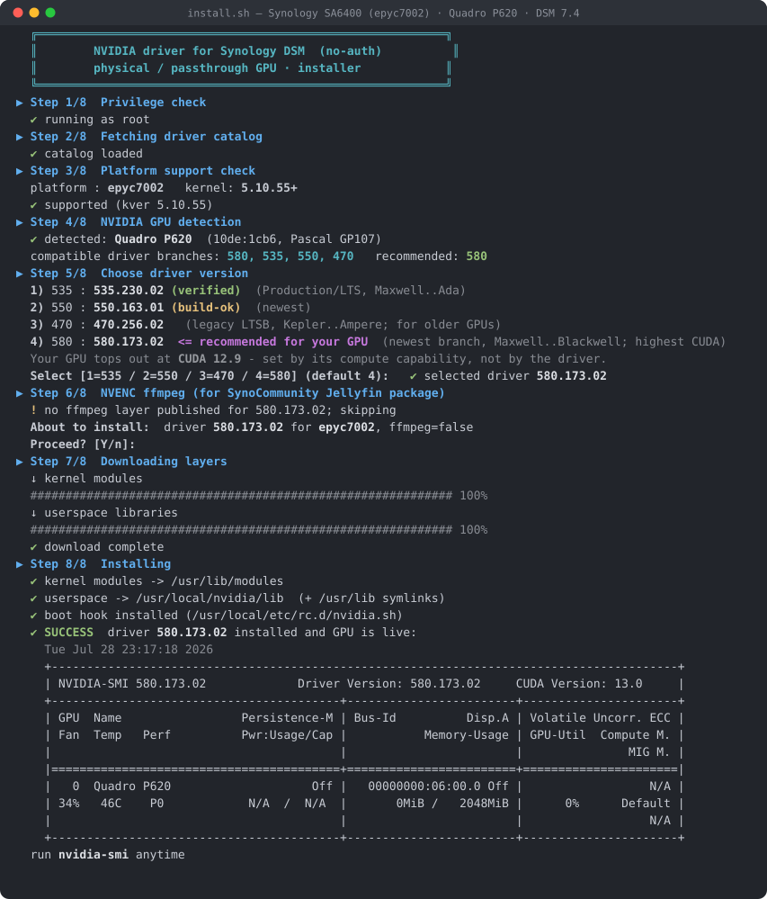
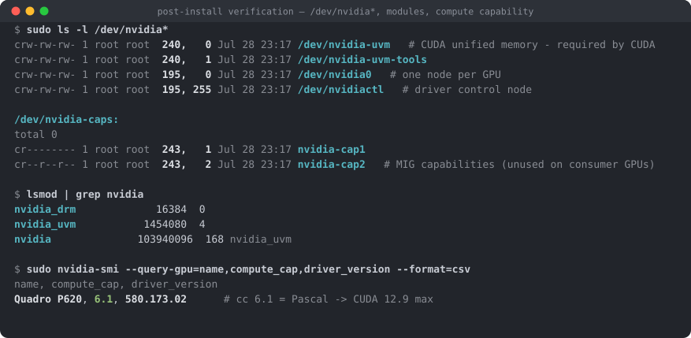
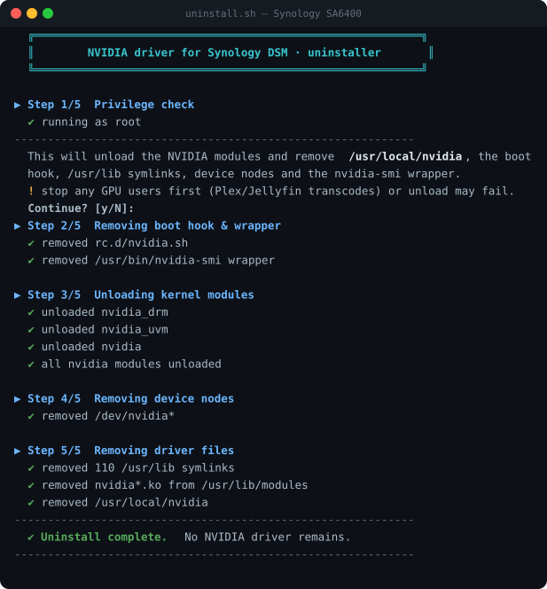

# syno_nvidia_driver

<a href="https://github.com/PeterSuh-Q3/syno_nvidia_driver/releases"></a>

[](https://github.com/sponsors/PeterSuh-Q3)

https://paypal.me/PeterSuhQ3

---

No-auth NVIDIA driver for Synology DSM — **physical / passthrough GPUs only, no
vGPU / license server** (unlike pdbear's closed SPK). Multiple driver versions
per GPU, auto-matched to your platform + DSM kernel.

---

## 🚀 Install (on a running DSM)

**Requirements:** root/`sudo`, internet, a **supported kver5 (5.10.55) platform**
(all 7 — see the [support matrix](#supported-platforms--driver-versions) below)
with an NVIDIA GPU (physical or passthrough). The installer auto-detects your
platform + GPU and refuses to run on anything it can't support.

```bash
curl -sL https://raw.githubusercontent.com/PeterSuh-Q3/syno_nvidia_driver/main/install.sh | sudo bash
```

It walks you through 8 steps — platform check → GPU detection → **version choice
(1=535 / 2=550 / 3=470 / 4=580)** → optional NVENC ffmpeg for the Jellyfin package
— then downloads, installs, loads the driver and verifies with `nvidia-smi`. A
**9th, optional step** sets up GPU access for Container Manager (Docker) if it's
installed — see [Container Manager (Docker) GPU access](#container-manager-docker-gpu-access)
below. The installer highlights the branch recommended for the GPU it found and
tells you the **highest CUDA version that GPU can actually run**, and deploys
**GSP firmware automatically** for GPUs that need it (Turing / Ampere so far).

<p align="center">
  
</p>

> Real run on **Synology SA6400 (epyc7002) · Quadro P620 · DSM 7.4** installing
> **580.173.02** — verified 2026-07-28, including Plex hardware transcoding.

A boot hook (`/usr/local/etc/rc.d/nvidia.sh`) is installed so the driver reloads
automatically after a reboot. Run `nvidia-smi` any time to check the GPU.

> ### ⚠️ Restart Plex / Jellyfin after installing
> Both enumerate GPUs **once, at their own startup**, and cache the result. If the
> package was already running when you installed (or removed) the driver, its
> hardware-transcoding device list is stale — the GPU simply will not appear in the
> settings, and transcodes fall back to software or fail.
>
> ```bash
> sudo /usr/syno/bin/synopkg restart PlexMediaServer
> ```
>
> This is by far the most common "the driver is installed but transcoding doesn't
> work" cause. It is **not** a driver/CUDA incompatibility.

### Verifying the install

The driver creates its device nodes on load. Checking them is the quickest way to
confirm a healthy install — and the first thing to look at if an app cannot see
the GPU:

```bash
sudo ls -l /dev/nvidia*
lsmod | grep nvidia
```

<p align="center">
  
</p>

| Node | Major | What it is |
|---|:---:|---|
| `/dev/nvidia0` | 195 | The GPU itself — **one node per physical GPU**. A second card appears as `nvidia1`. |
| `/dev/nvidiactl` | 195 | Driver control node; every client opens this first. |
| `/dev/nvidia-uvm` | 240 | Unified memory — **CUDA will not work without it**. |
| `/dev/nvidia-uvm-tools` | 240 | Debug/profiling companion to UVM. |
| `/dev/nvidia-caps/*` | 243 | MIG capability nodes; unused outside datacenter GPUs. |

What a healthy install looks like:

- **`nvidia0` count matches your GPU count.** If you see `nvidia0`…`nvidia7` on a
  single-GPU box, something created phantom nodes — the installer derives the count
  from `/proc/driver/nvidia/gpus/` precisely to avoid that.
- **`nvidia_uvm` is loaded** (`lsmod`). Without it `nvidia-smi` may still work while
  every CUDA application fails.
- `nvidia_modeset` / `nvidia_drm` missing is **normal on DSM** — Synology ships no
  `backlight.ko`, so they fail to load. They are display-only and irrelevant to
  compute and NVENC/NVDEC transcoding.
- Permissions are `crw-rw-rw-`, so unprivileged package users (Plex, Jellyfin,
  containers) can open them without extra setup.

If the nodes are missing entirely, the modules did not load — re-run the installer
or check `dmesg | grep -i nvrm`.

### NVENC ffmpeg (Jellyfin package)
Answer **y** at Step 6 to also install an NVENC-capable `ffmpeg` at
`/usr/local/nvidia/bin/ffmpeg`. Then in Jellyfin set **Dashboard → Playback →
FFmpeg path** to that binary. (Plex has its own transcoder and does not need this.)

## Container Manager (Docker) GPU access

If Container Manager is installed, `install.sh` offers an optional **Step 9**
that lets `docker run` containers use this GPU too (Ollama, PyTorch, vLLM, …).
It downloads a small runtime layer (`nvidia-container-cli` + friends, built from
NVIDIA's official upstream binaries — no compiling needed), registers a
**`nvidia`** runtime in Container Manager's `daemon.json` by **merging** (your
existing `bip`/`data-root`/etc. are preserved, and a backup is kept at
`dockerd.json.pre-nvidia.bak`), and builds an `ld.so.cache` for it (DSM ships
neither `ldconfig` nor a cache file, so a static one is bundled and used).

After it runs, restart Container Manager once:

```bash
sudo /usr/syno/bin/synopkg restart ContainerManager
```

Then test with:

```bash
docker run --rm --runtime=nvidia -e NVIDIA_VISIBLE_DEVICES=all \
  nvidia/cuda:12.9.0-base-ubuntu24.04 nvidia-smi
```

> **Use `--runtime=nvidia -e NVIDIA_VISIBLE_DEVICES=all`, not `--gpus all`.** The
> `--gpus` flag needs Docker 25+ CDI support; Synology's Container Manager (24.0.2
> as of this writing) doesn't have it and Synology controls that version, not you.
> The legacy `--runtime=nvidia` + env-var path works on any Docker version and is
> what NVIDIA's own `cuda`/`pytorch` images already expect (they set
> `NVIDIA_VISIBLE_DEVICES` themselves in many cases).

`uninstall.sh` reverses all of this — it restores `daemon.json` from the backup
(or strips just the `nvidia` key if the backup is missing) and removes the
runtime files. See [docs/container-runtime-design.md](docs/container-runtime-design.md)
for the full design notes, including five non-obvious gotchas found while getting
this working (noexec `/tmp`, no system `ldconfig`, hook paths, …) — all fixed and
verified end-to-end on real hardware (`nvidia-smi` running correctly inside a
container talking to a Quadro P620).

## 🧹 Uninstall

```bash
curl -sL https://raw.githubusercontent.com/PeterSuh-Q3/syno_nvidia_driver/main/uninstall.sh | sudo bash
```

<p align="center">
  
</p>

---

## Supported platforms & driver versions

All **kver5 (kernel 5.10.55)** Synology platforms are supported. Each cell is a
prebuilt `.ko` on the [`nvidia`](https://github.com/PeterSuh-Q3/syno_nvidia_driver/releases/tag/nvidia)
Release; the shared userspace layer (`nv-userspace-<ver>.tgz`) is identical per
driver version across every platform.

| Platform | Example models | 470.256.02 | 535.230.02 | 550.163.01 | **580.173.02** |
|---|---|:---:|:---:|:---:|:---:|
| `epyc7002`      | SA6400                         | ✅ | ✅ | ✅ | ✅ |
| `epyc7003`      | FS6420                         | ✅ | ✅ | ✅ | ✅ |
| `epyc7003ntb`   | PAS7700                        | ✅ | ✅ | ✅ | ✅ |
| `icelaked`      | FS3420 / RS3626xs / RS4826xs+  | ✅ | ✅ | ✅ | ✅ |
| `v1000nk`       | (Ryzen Embedded V1000, no-key) | ✅ | ✅ | ✅ | ✅ |
| `r1000nk`       | (Ryzen Embedded R1000, no-key) | ✅ | ✅ | ✅ | ✅ |
| `geminilakenk`  | DS225+ / DS425+                | ✅ | ✅ | ✅ | ✅ |

| Branch | GPU coverage | Native CUDA | Notes |
|---|---|:---:|---|
| **470.256.02** | Kepler … Ampere | 11.4 | Legacy LTSB — for old GPUs 535+ dropped. ffmpeg layer pinned to `jellyfin-ffmpeg 5.1.2-9` (NVENC API 11.1); never pair it with the 535/550 ffmpeg. |
| **535.230.02** | Maxwell … Ada | 12.2 | Production/LTS. Verified on P620. ffmpeg `6.0.1-8` (NVENC 12.0). |
| **550.163.01** | Maxwell … Ada | 12.4 | ffmpeg `7.0.2-9` (NVENC SDK 12.0, same pin as 535). |
| **580.173.02** | Maxwell … Ampere (Turing/GA10x) | **13.0** | Newest, and the **last branch supporting Maxwell/Pascal/Volta**. Verified on P620 incl. Plex HW transcoding. GSP firmware for Turing/Ampere(GA10x) is shipped and **auto-deployed by the installer**; Ada(RTX 40)/Blackwell(RTX 50) still need GSP firmware NVIDIA does not bundle in this `.run` — those chips hit a warning gate. ffmpeg `7.1.4-3`. |

- **580 is the recommended branch for most GPUs.** It supersedes 535/550 (same
  Maxwell→Ada coverage on the driver side) and raises what Pascal can run from
  CUDA 12.4 to **12.9**. Only Kepler-era cards still need 470.
- **GSP firmware for Turing / Ampere (GA10x)** — RTX 20xx, T4, GTX 16xx, RTX 30xx,
  A10 — is bundled (`nv-gsp-580.173.02.tgz`, extracted from the official `.run`)
  and the installer deploys it to `/lib/firmware/nvidia/580.173.02/` automatically,
  before the driver loads. No action needed beyond picking 580.
- ⚠️ **Ada (RTX 40) / Blackwell (RTX 50)** also require GSP firmware, but NVIDIA's
  580.173.02 `.run` does **not** bundle `gsp_ad10x.bin` or a Blackwell blob — the
  installer detects this and warns before letting you proceed (the driver would
  load but fail to initialise). Use 535/550 on those GPUs for now.
- One `.ko` per platform covers **DSM 7.1–7.4** because `CONFIG_MODVERSIONS` is off
  and the vermagic (`5.10.55+ SMP mod_unload`) is identical across those DSM
  releases — only the vermagic gates module load.

---

## CUDA versions — what actually applies to your GPU

This trips people up constantly, so it is worth being precise. **Two independent
things** decide which CUDA you can run:

| | Set by | What it limits |
|---|---|---|
| **Driver** | the branch you install | the highest CUDA API the driver speaks |
| **GPU architecture** (compute capability) | the silicon — cannot be changed | which CUDA toolkit versions can *generate code* for it |

CUDA 13.0 dropped code generation for everything below **compute capability 7.5
(Turing)**. So on a Pascal card, installing 580 does **not** unlock CUDA 13.0 —
there is simply no Pascal binary in a CUDA 13 build. Drivers are backward
compatible, so a 580 driver happily runs CUDA 12.x applications.

| Compute cap. | Architecture | Example GPUs | **Max usable CUDA** |
|:---:|---|---|:---:|
| 6.0 / 6.1 | Pascal | **Quadro P620 / P1000**, Tesla **P4 / P40 / P100**, GTX 10xx | **12.9** |
| 7.0 | Volta | Tesla V100 | 12.9 |
| **7.5** | **Turing** | **Tesla T4**, RTX 20xx | **13.0** |
| 8.0 / 8.6 | Ampere | A100 / A10, RTX 30xx | 13.0 |
| 8.9 | Ada | L4 / L40S, RTX 40xx | 13.0 |
| 12.0 | Blackwell | RTX 50xx | 13.0 |

**7.5 is the dividing line.** Below it the ceiling is 12.9; at or above it, 13.0.
Higher-capability cards also run every lower CUDA version.

### How to check your GPU's real CUDA ceiling

```bash
sudo nvidia-smi --query-gpu=name,compute_cap,driver_version --format=csv
```
```
name, compute_cap, driver_version
Quadro P620, 6.1, 580.173.02      →  cc 6.1 = Pascal  →  CUDA 12.9 max
```

> **Do not read the CUDA version off the `nvidia-smi` header.** On the P620 above it
> prints `CUDA Version: 13.0`, but that is only the *driver's* maximum — the GPU
> still cannot run CUDA 13.0. `compute_cap` is the value that decides.

`compute_cap` requires driver **≥ 510**, so it is unavailable on 470. There, read
the model name instead (`sudo nvidia-smi -q | grep "Product Name"`) and look it up
in the table above.

To check what an application actually gets, query it from inside your container:

```bash
python3 -c "import torch; print(torch.version.cuda, torch.cuda.get_device_capability(), torch.cuda.is_available())"
# e.g. 12.4 (6, 1) True   →  toolkit 12.4, compute capability 6.1, usable
```

### CUDA is irrelevant for transcoding

Plex and Jellyfin do **not** use the CUDA toolkit to transcode — they use the
dedicated **NVENC/NVDEC** engines via `libnvidia-encode.so.1` / `libnvcuvid.so.1`.
NVENC is backward compatible, so a newer driver runs a player's older NVENC code
fine. If hardware transcoding is missing, the cause is almost always the stale
device list described above (restart the package), not a CUDA version mismatch.

The one direction that *does* break is the opposite one: an **old driver with a
too-new ffmpeg** (e.g. 470 + an NVENC 12.x build). That is why each branch is
pinned to a matching ffmpeg layer.

### Why kver5 only?

The driver ships as a kernel module (`.ko`) that must match the **exact Synology
kernel** it loads into. Two hard constraints make kver5 the practical target:

1. **Kernel API vs. driver branch.** NVIDIA's open kernel-interface glue tracks
   modern kernel APIs. The **470 / 535 / 550 / 580** branches all compile cleanly
   against **5.10.55** (580 needs kernel ≥ 4.15 per NVIDIA), but on the older
   **kver4 (4.4.x, ~2016)** and **kver3 (3.10.x)** Synology kernels the newer glue
   fails to build — those kernels would need a *legacy* branch (470 / 390), which
   in turn drops support for newer GPUs. So "one modern branch for every platform"
   only holds on kver5.
2. **Toolchain + kernel tree availability.** Builds run against the per-platform
   `/opt/<platform>/build` kernel tree inside the `dante90/syno-compiler`
   container. The kver5 trees are the ones wired up and validated here.

kver4 / kver3 platforms are therefore **out of scope for the 535/550/580 line**. They
are technically buildable with a legacy branch, but that is a separate matrix
(different branch, different GPU coverage) and is not currently shipped.

---

## About (build / producer side)

Builds the **no-auth NVIDIA driver** (2-layer package) for Synology DSM kver5
platforms. Physical / passthrough GPUs only — **no vGPU / license server**
(unlike pdbear's closed SPK). Multiple driver versions per GPU.

This repo is the **build/producer** side. It borrows the
`dante90/syno-compiler:<DSM>` container (the same toolchain base mshell-modules
uses) but is otherwise independent of both mshell-modules and tcrp-addons.

## Where it fits

```
mshell-modules ── provides ──> dante90/syno-compiler:<DSM>  +  /opt/<platform>/build
                                        │ (container + kernel tree reused, not the repo tree)
                                        ▼
        THIS REPO (syno_nvidia_driver, cloned on build VM 192.168.45.139)
          build-nvidia.sh → 2-layer tgz → GitHub Release (tag: nvidia)
                                        │
                                        ▼
        tcrp-addons/nvidiadriver  ── consumer: install.sh + nvidia-index.json
          (references the Release URLs; loader fetches at build time → DSM)
```

Only NVIDIA's **open** kernel-interface glue is recompiled and linked against the
closed `nv-kernel` blob, so the `.ko` vermagic + `CONFIG_MODVERSIONS` CRCs match
the exact DSM kernel (the fix for the issue-#77 "Unknown symbol" failure).

## 2-layer packaging

| layer | file | scope |
|---|---|---|
| kernel | `nv-ko-<ver>-<platform>-<kvershort>.tgz` | **per platform** (~MB) |
| userspace | `nv-userspace-<ver>.tgz` | **per version** only, x86_64 shared across kver5 platforms |

## Build (on VM 192.168.45.139)

```bash
ssh dante90@192.168.45.139
git -C ~/syno_nvidia_driver pull            # always sync first
cd ~/syno_nvidia_driver
# download the .run once (open glue + closed nv-kernel blob)
curl -kLo run/NVIDIA-Linux-x86_64-535.183.06.run \
  https://us.download.nvidia.com/XFree86/Linux-x86_64/535.183.06/NVIDIA-Linux-x86_64-535.183.06.run
./run-on-vm.sh 535.183.06 epyc7002 7.4      # <ver> <platform> <DSM_VER>
```

Outputs land in `out/` with a printed `nvidia-index.json` fragment (incl. sha256).

## Publish

1. Upload both `out/*.tgz` to this repo's Release tagged **`nvidia`**.
2. Paste the printed fragment into `tcrp-addons/nvidiadriver/src/nvidia-index.json`
   and push tcrp-addons.

## Files

- [build-nvidia.sh](build-nvidia.sh) — runs inside the compiler container; builds both layers
- [run-on-vm.sh](run-on-vm.sh) — `sudo docker` wrapper for the build VM
- `run/` — put `NVIDIA-Linux-x86_64-<ver>.run` here (git-ignored)
- `out/` — build artifacts (git-ignored)

## Notes / limits

- `.ko` are unsigned → DSM logs `module verification failed … tainting` — benign
  (`MODULE_SIG_FORCE` not set, modules still load).
- Target is **kver5 (5.10.55)** where 470/535/550/580 all build fine (each
  verified — vermagic matches, `nvUvmInterface` exported). On kver4 (4.4.x) the
  newer branches may not compile — the legacy 470 branch is the fallback.
- **Compat patches move between branches.** Synology builds with
  `CONFIG_X86_PAT` off, forcing NVIDIA's builtin-PAT path, which uses
  `__flush_tlb()` and `__write_cr4()` — neither usable from a module on 5.10.
  `build-nvidia.sh` rewrites both, but their *location* changes: ≤550 kept the CR4
  write in `common/inc/nv-linux.h`, 580 calls it directly in `nvidia/nv-pat.c`
  with a different argument shape. The patcher therefore searches the tree and
  **aborts the build if any call site survives** — a silently skipped patch used
  to surface only as an unrelated `native_write_cr4 undefined` modpost error.
- R515+ branches load **GSP firmware** on Turing and newer. Extracted from the
  official `.run` (it ships `gsp_tu10x.bin` + `gsp_ga10x.bin` only — no Ada/
  Blackwell blob), packaged as `nv-gsp-<ver>.tgz`, and deployed by `install.sh` to
  `/lib/firmware/nvidia/<ver>/` **before** the kernel module loads (GSP is
  requested via `request_firmware()` at probe time, so order matters).
  `/lib/firmware` lives on the same rw root as everything else here, so this
  persists across reboots with no redeploy needed. GPUs needing GSP with no
  bundled blob (Ada/Blackwell) still hit `install.sh`'s warning gate.
  **Caveat: wired up and unit-tested (download/sha256/placement), but not yet
  validated against real Turing/Ampere hardware** — the only box available this
  session has a Pascal GPU, which skips the GSP path entirely.

## Workflow rule

Source change → **commit/push here first** → on the VM **`git pull`** → then build.
Never build from uncommitted local changes.

---

<details>
<summary>🇰🇷 <b>한국어 번역 (펼쳐 보기)</b></summary>

<br>

# syno_nvidia_driver

Synology DSM용 **무인증(no-auth)** NVIDIA 드라이버 — **물리 / passthrough GPU 전용,
vGPU · 라이선스 서버 없음**(pdbear의 폐쇄 SPK와 다름). GPU마다 여러 드라이버 버전을
제공하며, 플랫폼 + DSM 커널에 자동으로 매칭됩니다.

---

## 🚀 설치 (구동 중인 DSM에서)

**요구 사항:** root/`sudo`, 인터넷, **지원되는 kver5(5.10.55) 플랫폼**(7종 전부 —
아래 [지원 매트릭스](#supported-platforms--driver-versions) 참고)과 NVIDIA GPU(물리
또는 passthrough). 설치 스크립트가 플랫폼 + GPU를 자동 감지하며, 지원 불가한 환경에서는
실행을 거부합니다.

```bash
curl -sL https://raw.githubusercontent.com/PeterSuh-Q3/syno_nvidia_driver/main/install.sh | sudo bash
```

8단계로 안내합니다 — 플랫폼 확인 → GPU 감지 → **버전 선택(1=535 / 2=550 / 3=470 / 4=580)**
→ (선택) Jellyfin 패키지용 NVENC ffmpeg → 이후 다운로드·설치·드라이버 로드 후 `nvidia-smi`로
검증. **선택 9단계**는 Container Manager(Docker)가 설치돼 있으면 그 안에서도 GPU를 쓸 수
있게 설정합니다 — 아래 [Container Manager(Docker) GPU 연동](#container-managerdocker-gpu-연동)
참고. 감지된 GPU에 권장되는 브랜치를 표시하고, **그 GPU가 실제로 사용할 수 있는 최대 CUDA
버전**까지 알려주며, 필요한 GPU(현재는 Turing/Ampere)에는 **GSP 펌웨어를 자동 배치**합니다.

> **Synology SA6400(epyc7002) · Quadro P620 · DSM 7.4**에서 **580.173.02** 설치 실기 검증
> — 2026-07-28, Plex 하드웨어 트랜스코딩까지 확인.

부팅 훅(`/usr/local/etc/rc.d/nvidia.sh`)이 설치되어 재부팅 후 드라이버가 자동으로 다시
로드됩니다. 언제든 `nvidia-smi`로 GPU 상태를 확인하세요.

> ### ⚠️ 설치 후 Plex / Jellyfin을 반드시 재시작하세요
> 두 프로그램 모두 **자신이 기동할 때 GPU를 한 번만 열거**하고 그 결과를 캐시합니다.
> 드라이버를 설치(또는 제거)할 때 패키지가 이미 실행 중이었다면 하드웨어 트랜스코딩 장치
> 목록이 낡은 상태로 남아, GPU가 설정 화면에 아예 나타나지 않고 트랜스코딩이 소프트웨어로
> 떨어지거나 실패합니다.
>
> ```bash
> sudo /usr/syno/bin/synopkg restart PlexMediaServer
> ```
>
> "드라이버는 깔렸는데 트랜스코딩이 안 된다"의 압도적 다수가 이 원인이며,
> 드라이버·CUDA 호환성 문제가 **아닙니다**.

### 설치 검증

드라이버는 로드될 때 디바이스 노드를 만듭니다. 이 노드를 확인하는 것이 설치가 정상인지
가장 빠르게 판별하는 방법이며, 앱이 GPU를 못 볼 때 가장 먼저 봐야 할 곳이기도 합니다:

```bash
sudo ls -l /dev/nvidia*
lsmod | grep nvidia
```

<p align="center">
  
</p>

| 노드 | Major | 정체 |
|---|:---:|---|
| `/dev/nvidia0` | 195 | GPU 본체 — **물리 GPU 1장당 노드 1개**. 두 번째 카드는 `nvidia1`로 나타납니다. |
| `/dev/nvidiactl` | 195 | 드라이버 제어 노드. 모든 클라이언트가 가장 먼저 여는 노드입니다. |
| `/dev/nvidia-uvm` | 240 | 통합 메모리 — **이게 없으면 CUDA가 동작하지 않습니다**. |
| `/dev/nvidia-uvm-tools` | 240 | UVM 디버그/프로파일링용 보조 노드. |
| `/dev/nvidia-caps/*` | 243 | MIG 기능 노드. 데이터센터 GPU 외에는 사용되지 않습니다. |

정상 설치의 판별 기준:

- **`nvidia0` 개수가 실제 GPU 장수와 일치**해야 합니다. GPU 1장인데 `nvidia0`~`nvidia7`이
  보인다면 유령 노드가 생긴 것입니다 — 설치 스크립트는 이를 막기 위해
  `/proc/driver/nvidia/gpus/` 에서 개수를 산출합니다.
- **`nvidia_uvm`이 로드되어 있어야 합니다**(`lsmod`). 이게 없으면 `nvidia-smi`는 동작해도
  CUDA 애플리케이션은 전부 실패합니다.
- `nvidia_modeset` / `nvidia_drm`이 없는 것은 **DSM에서 정상**입니다 — Synology에
  `backlight.ko`가 없어 로드에 실패합니다. 디스플레이 전용이라 컴퓨트와 NVENC/NVDEC
  트랜스코딩에는 무관합니다.
- 권한이 `crw-rw-rw-`이므로 비특권 패키지 사용자(Plex, Jellyfin, 컨테이너)가 별도 설정
  없이 열 수 있습니다.

노드가 아예 없다면 모듈이 로드되지 않은 것입니다 — 설치를 다시 실행하거나
`dmesg | grep -i nvrm`을 확인하세요.

### NVENC ffmpeg (Jellyfin 패키지)
6단계에서 **y**를 선택하면 `/usr/local/nvidia/bin/ffmpeg`에 NVENC 지원 `ffmpeg`도 함께
설치됩니다. 이후 Jellyfin의 **대시보드 → 재생 → FFmpeg 경로**를 해당 바이너리로 지정하세요.
(Plex는 자체 트랜스코더가 있어 필요 없습니다.)

## Container Manager(Docker) GPU 연동

Container Manager가 설치돼 있으면 `install.sh`가 **선택 9단계**로 `docker run`
컨테이너도 이 GPU를 쓸 수 있게 설정할지 물어봅니다(Ollama, PyTorch, vLLM 등).
작은 런타임 레이어(`nvidia-container-cli` 등, NVIDIA 공식 upstream 바이너리로
빌드 — 직접 컴파일 불필요)를 내려받고, Container Manager의 `daemon.json`에
**`nvidia` 런타임을 병합**으로 등록하며(기존 `bip`/`data-root` 등은 그대로
유지되고, 백업이 `dockerd.json.pre-nvidia.bak`에 남습니다), `ld.so.cache`도
직접 만들어 줍니다(DSM에는 `ldconfig`도 캐시 파일도 없어 정적 바이너리를
동봉해 사용합니다).

실행 후 Container Manager를 한 번 재시작하세요:

```bash
sudo /usr/syno/bin/synopkg restart ContainerManager
```

그다음 테스트:

```bash
docker run --rm --runtime=nvidia -e NVIDIA_VISIBLE_DEVICES=all \
  nvidia/cuda:12.9.0-base-ubuntu24.04 nvidia-smi
```

> **`--gpus all`이 아니라 `--runtime=nvidia -e NVIDIA_VISIBLE_DEVICES=all`을
> 쓰세요.** `--gpus` 플래그는 Docker 25+의 CDI 지원이 필요한데, Synology
> Container Manager(이 글 작성 시점 24.0.2)는 이를 갖고 있지 않고 그 버전은
> Synology가 정합니다(사용자가 올릴 수 없음). 레거시 `--runtime=nvidia` +
> 환경변수 방식은 Docker 버전과 무관하게 동작하며, NVIDIA의 `cuda`/`pytorch`
> 이미지들이 이미 기대하는 방식이기도 합니다(다수가 `NVIDIA_VISIBLE_DEVICES`를
> 이미지 자체에 설정해 둡니다).

`uninstall.sh`가 이 모든 것을 역순으로 되돌립니다 — 백업이 있으면 `daemon.json`을
그걸로 복원하고(없으면 `nvidia` 키만 제거), 런타임 파일을 삭제합니다. 전체
설계 내용과, 작업 중 발견한 다섯 가지 비직관적인 함정(`/tmp` noexec, 시스템
`ldconfig` 부재, 훅 경로 등 — 전부 수정하고 실기에서 왕복 검증 완료)은
[docs/container-runtime-design.md](docs/container-runtime-design.md)에 정리돼
있습니다. 실제로 Quadro P620과 통신하는 컨테이너 안에서 `nvidia-smi`가 정상
동작하는 것까지 확인했습니다.

## 🧹 제거

```bash
curl -sL https://raw.githubusercontent.com/PeterSuh-Q3/syno_nvidia_driver/main/uninstall.sh | sudo bash
```

---

## 지원 플랫폼 & 드라이버 버전

모든 **kver5(커널 5.10.55)** Synology 플랫폼을 지원합니다. 각 칸은
[`nvidia`](https://github.com/PeterSuh-Q3/syno_nvidia_driver/releases/tag/nvidia)
Release에 올라간 사전 빌드 `.ko`이며, 공유 userspace 레이어
(`nv-userspace-<ver>.tgz`)는 드라이버 버전별로 모든 플랫폼에서 동일합니다.

| 플랫폼 | 예시 모델 | 470.256.02 | 535.230.02 | 550.163.01 | **580.173.02** |
|---|---|:---:|:---:|:---:|:---:|
| `epyc7002`      | SA6400                          | ✅ | ✅ | ✅ | ✅ |
| `epyc7003`      | FS6420                          | ✅ | ✅ | ✅ | ✅ |
| `epyc7003ntb`   | PAS7700                         | ✅ | ✅ | ✅ | ✅ |
| `icelaked`      | FS3420 / RS3626xs / RS4826xs+   | ✅ | ✅ | ✅ | ✅ |
| `v1000nk`       | (Ryzen Embedded V1000, no-key)  | ✅ | ✅ | ✅ | ✅ |
| `r1000nk`       | (Ryzen Embedded R1000, no-key)  | ✅ | ✅ | ✅ | ✅ |
| `geminilakenk`  | DS225+ / DS425+                 | ✅ | ✅ | ✅ | ✅ |

| 브랜치 | GPU 커버리지 | 네이티브 CUDA | 비고 |
|---|---|:---:|---|
| **470.256.02** | Kepler … Ampere | 11.4 | 레거시 LTSB — 535 이상이 버린 구형 GPU용. ffmpeg 레이어는 `jellyfin-ffmpeg 5.1.2-9`(NVENC API 11.1) 고정이며 535/550용 ffmpeg와 절대 섞으면 안 됩니다. |
| **535.230.02** | Maxwell … Ada | 12.2 | Production/LTS. P620 검증. ffmpeg `6.0.1-8`(NVENC 12.0). |
| **550.163.01** | Maxwell … Ada | 12.4 | ffmpeg `7.0.2-9`(NVENC SDK 12.0, 535 와 동일 핀). |
| **580.173.02** | Maxwell … Ampere(Turing/GA10x) | **13.0** | 최신이자 **Maxwell/Pascal/Volta를 지원하는 마지막 브랜치**. P620에서 Plex 하드웨어 트랜스코딩까지 검증. Turing/Ampere(GA10x)용 GSP 펌웨어는 확보되어 **설치 스크립트가 자동 배치**합니다. Ada(RTX 40)/Blackwell(RTX 50)은 이 `.run`에 해당 펌웨어가 없어 여전히 경고 게이트가 적용됩니다. ffmpeg `7.1.4-3`. |

- **대부분의 GPU에는 580이 권장 브랜치입니다.** 535/550을 대체하며(드라이버 측에서는
  동일한 Maxwell→Ada 커버리지), Pascal이 실행할 수 있는 CUDA를 12.4에서 **12.9**로
  올려줍니다. Kepler 세대 카드만 여전히 470이 필요합니다.
- **Turing / Ampere(GA10x)용 GSP 펌웨어**(RTX 20xx, T4, GTX 16xx, RTX 30xx, A10)는
  공식 `.run`에서 추출해 동봉했으며(`nv-gsp-580.173.02.tgz`), 설치 스크립트가 드라이버
  로드 전에 `/lib/firmware/nvidia/580.173.02/`에 자동으로 배치합니다. 580을 선택하는
  것 외에 별도 조치가 필요 없습니다.
- ⚠️ **Ada(RTX 40)/Blackwell(RTX 50)** 도 GSP 펌웨어가 필요하지만, NVIDIA의
  580.173.02 `.run`에는 `gsp_ad10x.bin`이나 Blackwell용 blob이 **들어있지 않습니다** —
  설치 스크립트가 이를 감지해 진행 전 경고합니다(드라이버는 설치되지만 초기화에
  실패함). 해당 GPU는 당분간 535/550을 사용하세요.
- 플랫폼당 하나의 `.ko`가 **DSM 7.1–7.4**를 모두 커버합니다 — `CONFIG_MODVERSIONS`가
  꺼져 있고 vermagic(`5.10.55+ SMP mod_unload`)이 해당 DSM 릴리즈 전체에서 동일해,
  모듈 로드를 오직 vermagic만 판정하기 때문입니다.

---

## CUDA 버전 — 내 GPU에 실제로 적용되는 것

혼동이 잦은 부분이라 정확히 짚습니다. **서로 독립적인 두 가지**가 사용 가능한 CUDA를 결정합니다:

| | 결정 주체 | 제한하는 것 |
|---|---|---|
| **드라이버** | 설치한 브랜치 | 드라이버가 지원하는 최대 CUDA API |
| **GPU 아키텍처**(compute capability) | 실리콘 — 변경 불가 | 어떤 CUDA 툴킷 버전이 **코드를 생성**해줄 수 있는지 |

CUDA 13.0은 **compute capability 7.5(Turing) 미만**에 대한 코드 생성을 삭제했습니다.
따라서 Pascal 카드에 580을 설치해도 CUDA 13.0이 열리지 **않습니다** — CUDA 13 빌드에는
Pascal용 바이너리가 애초에 없기 때문입니다. 드라이버는 하위 호환이므로 580 드라이버는
CUDA 12.x 애플리케이션을 문제없이 실행합니다.

| Compute cap. | 아키텍처 | 예시 GPU | **사용 가능 최대 CUDA** |
|:---:|---|---|:---:|
| 6.0 / 6.1 | Pascal | **Quadro P620 / P1000**, Tesla **P4 / P40 / P100**, GTX 10xx | **12.9** |
| 7.0 | Volta | Tesla V100 | 12.9 |
| **7.5** | **Turing** | **Tesla T4**, RTX 20xx | **13.0** |
| 8.0 / 8.6 | Ampere | A100 / A10, RTX 30xx | 13.0 |
| 8.9 | Ada | L4 / L40S, RTX 40xx | 13.0 |
| 12.0 | Blackwell | RTX 50xx | 13.0 |

**7.5가 분기점입니다.** 미만이면 상한 12.9, 이상이면 13.0. 상위 카드는 하위 CUDA를 모두
실행합니다.

### 내 GPU의 실제 CUDA 상한 확인 방법

```bash
sudo nvidia-smi --query-gpu=name,compute_cap,driver_version --format=csv
```
```
name, compute_cap, driver_version
Quadro P620, 6.1, 580.173.02      →  cc 6.1 = Pascal  →  CUDA 최대 12.9
```

> **`nvidia-smi` 헤더의 CUDA 버전을 믿지 마세요.** 위 P620에서도 `CUDA Version: 13.0`으로
> 표시되지만 이는 *드라이버의* 최대치일 뿐이고, 그 GPU는 여전히 CUDA 13.0을 실행할 수
> 없습니다. 판정하는 값은 `compute_cap`입니다.

`compute_cap` 쿼리는 드라이버 **510 이상**에서만 지원되므로 470에서는 사용할 수 없습니다.
그 경우 모델명(`sudo nvidia-smi -q | grep "Product Name"`)을 확인해 위 표에서 찾으세요.

애플리케이션이 실제로 무엇을 받는지는 컨테이너 안에서 확인합니다:

```bash
python3 -c "import torch; print(torch.version.cuda, torch.cuda.get_device_capability(), torch.cuda.is_available())"
# 예: 12.4 (6, 1) True   →  툴킷 12.4, compute capability 6.1, 사용 가능
```

### 트랜스코딩에는 CUDA가 무관합니다

Plex와 Jellyfin은 트랜스코딩에 CUDA 툴킷을 **쓰지 않습니다** — `libnvidia-encode.so.1` /
`libnvcuvid.so.1`을 통해 전용 **NVENC/NVDEC** 엔진을 사용합니다. NVENC은 하위 호환이므로
신형 드라이버가 플레이어의 구형 NVENC 코드를 문제없이 실행합니다. 하드웨어 트랜스코딩이
안 보인다면 원인은 대개 위에서 설명한 낡은 장치 목록(패키지 재시작 필요)이지 CUDA 버전
불일치가 아닙니다.

실제로 깨지는 것은 반대 방향입니다 — **구형 드라이버 + 너무 새로운 ffmpeg**(예: 470 +
NVENC 12.x 빌드). 각 브랜치에 맞는 ffmpeg 레이어를 고정해 둔 이유가 이것입니다.

### 왜 kver5만 지원하나요?

이 드라이버는 로드되는 **정확한 Synology 커널**과 일치해야 하는 커널 모듈(`.ko`)로
배포됩니다. kver5를 현실적 타깃으로 만드는 두 가지 제약이 있습니다:

1. **커널 API vs. 드라이버 브랜치.** NVIDIA의 오픈 커널 인터페이스 glue는 최신 커널
   API를 따라갑니다. **470 / 535 / 550 / 580** 브랜치는 모두 **5.10.55**에서 깨끗이
   컴파일되지만(580은 NVIDIA 기준 커널 4.15 이상 필요), 더
   오래된 **kver4(4.4.x, 약 2016년)** · **kver3(3.10.x)** Synology 커널에서는 동일한
   glue가 빌드에 실패합니다 — 이 커널들은 *레거시* 브랜치(470 / 390)가 필요하고, 그러면
   최신 GPU(Ampere / Ada) 지원이 빠집니다. 따라서 "모든 플랫폼에 최신 브랜치 하나"는
   kver5에서만 성립합니다.
2. **툴체인 + 커널 트리 가용성.** 빌드는 `dante90/syno-compiler` 컨테이너 안의
   플랫폼별 `/opt/<platform>/build` 커널 트리를 대상으로 수행됩니다. kver5 트리들이
   여기서 연결·검증된 대상입니다.

그러므로 kver4 / kver3 플랫폼은 **535/550/580 라인의 범위 밖**입니다. 레거시 브랜치로는
기술적으로 빌드가 가능하지만, 그것은 별도의 매트릭스(다른 브랜치, 다른 GPU 커버리지)이며
현재 배포하지 않습니다.

---

## 소개 (빌드 / 생산자 측)

Synology DSM kver5 플랫폼용 **무인증 NVIDIA 드라이버**(2층 패키지)를 빌드합니다. 물리 /
passthrough GPU 전용 — **vGPU · 라이선스 서버 없음**(pdbear의 폐쇄 SPK와 다름). GPU마다
여러 드라이버 버전을 제공합니다.

이 repo는 **빌드/생산자** 측입니다. `dante90/syno-compiler:<DSM>` 컨테이너(mshell-modules가
쓰는 것과 동일한 툴체인 base)를 빌려 쓰지만, mshell-modules · tcrp-addons 양쪽으로부터
독립적입니다.

### 구조상 위치

```
mshell-modules ── 제공 ──> dante90/syno-compiler:<DSM>  +  /opt/<platform>/build
                                     │ (컨테이너 + 커널 트리만 재사용, repo 트리는 아님)
                                     ▼
        이 REPO (syno_nvidia_driver, 빌드 VM 192.168.45.139에 클론)
          build-nvidia.sh → 2층 tgz → GitHub Release (tag: nvidia)
                                     │
                                     ▼
        tcrp-addons/nvidiadriver  ── 소비자: install.sh + nvidia-index.json
          (Release URL 참조; loader가 빌드 시점에 fetch → DSM)
```

NVIDIA의 **오픈** 커널 인터페이스 glue만 재컴파일해 폐쇄 `nv-kernel` blob과 링크하므로,
`.ko`의 vermagic + `CONFIG_MODVERSIONS` CRC가 정확한 DSM 커널과 일치합니다(이슈 #77의
"Unknown symbol" 실패에 대한 해결책).

### 2층 패키징

| 레이어 | 파일 | 범위 |
|---|---|---|
| 커널 | `nv-ko-<ver>-<platform>-<kvershort>.tgz` | **플랫폼별** (~MB) |
| userspace | `nv-userspace-<ver>.tgz` | **버전별** 1개, x86_64 공통(kver5 플랫폼 공유) |

### 빌드 (VM 192.168.45.139에서)

```bash
ssh dante90@192.168.45.139
git -C ~/syno_nvidia_driver pull            # 항상 먼저 동기화
cd ~/syno_nvidia_driver
# .run 을 한 번 받는다 (오픈 glue + 폐쇄 nv-kernel blob)
curl -kLo run/NVIDIA-Linux-x86_64-535.183.06.run \
  https://us.download.nvidia.com/XFree86/Linux-x86_64/535.183.06/NVIDIA-Linux-x86_64-535.183.06.run
./run-on-vm.sh 535.183.06 epyc7002 7.4      # <ver> <platform> <DSM_VER>
```

결과물은 `out/`에 생성되며, sha256을 포함한 `nvidia-index.json` fragment가 출력됩니다.

### 배포

1. `out/*.tgz` 두 개를 이 repo의 **`nvidia`** 태그 Release에 업로드합니다.
2. 출력된 fragment를 `tcrp-addons/nvidiadriver/src/nvidia-index.json`에 붙여넣고
   tcrp-addons를 push합니다.

### 참고 / 한계

- `.ko`는 서명되지 않아 DSM이 `module verification failed … tainting`을 남깁니다 —
  무해합니다(`MODULE_SIG_FORCE` 미설정, 모듈은 정상 로드).
- 타깃은 470/535/550/580이 모두 정상 빌드되는 **kver5(5.10.55)**입니다(각각 검증 —
  vermagic 일치, `nvUvmInterface` export 확인). kver4(4.4.x)에서는 신규 브랜치가
  컴파일되지 않을 수 있으며, 레거시 470 브랜치가 대안입니다.
- **호환 패치의 위치는 브랜치마다 이동합니다.** Synology는 `CONFIG_X86_PAT`를 끈 채
  빌드하므로 NVIDIA의 builtin-PAT 경로가 강제되고, 이 경로가 쓰는 `__flush_tlb()`와
  `__write_cr4()`는 5.10에서 모듈이 사용할 수 없습니다. `build-nvidia.sh`가 둘 다
  치환하지만 *위치*가 바뀝니다 — 550 이하는 CR4 쓰기를 `common/inc/nv-linux.h`에 두었고,
  580은 `nvidia/nv-pat.c`에서 다른 인자 형태로 직접 호출합니다. 그래서 패처는 트리를
  탐색하며, **호출부가 하나라도 남으면 빌드를 중단합니다** — 조용히 건너뛴 패치는 예전에
  무관해 보이는 `native_write_cr4 undefined` modpost 에러로만 드러났기 때문입니다.
- R515+ 브랜치는 Turing 이상에서 **GSP 펌웨어**를 로드합니다. 공식 `.run`에서
  추출했으며(`gsp_tu10x.bin` + `gsp_ga10x.bin`만 존재 — Ada/Blackwell용 blob은
  없음), `nv-gsp-<ver>.tgz`로 패키징해 `install.sh`가 커널 모듈 로드 **전에**
  `/lib/firmware/nvidia/<ver>/`에 배치합니다(GSP는 probe 시점에
  `request_firmware()`로 요청되므로 순서가 중요합니다). `/lib/firmware`는 다른
  파일들과 같은 rw 루트에 있어 재부팅 후에도 유지되고 재배치가 필요 없습니다.
  펌웨어가 없는 GSP 필요 GPU(Ada/Blackwell)는 여전히 `install.sh`의 경고
  게이트에 걸립니다.
  **한계: 다운로드/sha256/배치까지 단위 검증은 했으나, 실제 Turing/Ampere
  하드웨어로는 아직 검증하지 못했습니다** — 이번 세션에 접근 가능한 유일한
  박스가 Pascal GPU라 GSP 경로 자체가 스킵됩니다.

### 작업 규칙

소스 변경 → **여기서 먼저 commit/push** → VM에서 **`git pull`** → 그다음 빌드.
커밋되지 않은 로컬 변경으로는 절대 빌드하지 않습니다.

</details>
