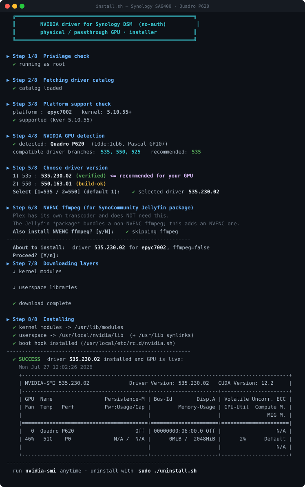

# syno_nvidia_driver

No-auth NVIDIA driver for Synology DSM — **physical / passthrough GPUs only, no
vGPU / license server** (unlike pdbear's closed SPK). Multiple driver versions
per GPU, auto-matched to your platform + DSM kernel.

---

## 🚀 Install (on a running DSM)

**Requirements:** root/`sudo`, internet, a **supported kver5 (5.10.55) platform**
(all 7 — see the [support matrix](#supported-platforms--driver-versions) below)
with an NVIDIA GPU (physical or passthrough). The installer auto-detects your
platform + GPU and refuses to run on anything it can't support.

```bash
curl -sL https://raw.githubusercontent.com/PeterSuh-Q3/syno_nvidia_driver/main/install.sh | sudo bash
```

It walks you through 8 steps — platform check → GPU detection → **version choice
(1=535 / 2=550)** → optional NVENC ffmpeg for the Jellyfin package — then
downloads, installs, loads the driver and verifies with `nvidia-smi`.

<p align="center">
  
</p>

> Real run on **Synology SA6400 (epyc7002) · Quadro P620 · DSM 7.4.1** — verified 2026-07-27.

A boot hook (`/usr/local/etc/rc.d/nvidia.sh`) is installed so the driver reloads
automatically after a reboot. Run `nvidia-smi` any time to check the GPU.

### NVENC ffmpeg (Jellyfin package)
Answer **y** at Step 6 to also install an NVENC-capable `ffmpeg` at
`/usr/local/nvidia/bin/ffmpeg`. Then in Jellyfin set **Dashboard → Playback →
FFmpeg path** to that binary. (Plex has its own transcoder and does not need this.)

## 🧹 Uninstall

```bash
curl -sL https://raw.githubusercontent.com/PeterSuh-Q3/syno_nvidia_driver/main/uninstall.sh | sudo bash
```

<p align="center">
  
</p>

---

## Supported platforms & driver versions

All **kver5 (kernel 5.10.55)** Synology platforms are supported. Each cell is a
prebuilt `.ko` on the [`nvidia`](https://github.com/PeterSuh-Q3/syno_nvidia_driver/releases/tag/nvidia)
Release; the shared userspace layer (`nv-userspace-<ver>.tgz`) is identical per
driver version across every platform.

| Platform | Example models | 535.230.02 | 550.163.01 |
|---|---|:---:|:---:|
| `epyc7002`      | SA6400                         | ✅ | ✅ |
| `epyc7003`      | FS6420                         | ✅ | ✅ |
| `epyc7003ntb`   | PAS7700                        | ✅ | ✅ |
| `icelaked`      | FS3420 / RS3626xs / RS4826xs+  | ✅ | ✅ |
| `v1000nk`       | (Ryzen Embedded V1000, no-key) | ✅ | ✅ |
| `r1000nk`       | (Ryzen Embedded R1000, no-key) | ✅ | ✅ |
| `geminilakenk`  | DS225+ / DS425+                | ✅ | ✅ |

- **535.230.02** — verified live on a **Quadro P620** (epyc7002 / DSM 7.4.1). NVENC
  12.0, pairs with the Jellyfin package's `jellyfin-ffmpeg 6.0.1-8`.
- **550.163.01** — newer branch (NVENC 12.1). Both branches cover Maxwell → Ada.
- One `.ko` per platform covers **DSM 7.1–7.4** because `CONFIG_MODVERSIONS` is off
  and the vermagic (`5.10.55+ SMP mod_unload`) is identical across those DSM
  releases — only the vermagic gates module load.

### Why kver5 only?

The driver ships as a kernel module (`.ko`) that must match the **exact Synology
kernel** it loads into. Two hard constraints make kver5 the practical target:

1. **Kernel API vs. driver branch.** NVIDIA's open kernel-interface glue tracks
   modern kernel APIs. The **535 / 550** branches compile cleanly against
   **5.10.55**, but on the older **kver4 (4.4.x, ~2016)** and **kver3 (3.10.x)**
   Synology kernels the same glue fails to build — those kernels would need a
   *legacy* driver branch (470 / 390), which in turn drops support for newer GPUs
   (Ampere / Ada). So "one modern branch for every platform" only holds on kver5.
2. **Toolchain + kernel tree availability.** Builds run against the per-platform
   `/opt/<platform>/build` kernel tree inside the `dante90/syno-compiler`
   container. The kver5 trees are the ones wired up and validated here.

kver4 / kver3 platforms are therefore **out of scope for the 535/550 line**. They
are technically buildable with a legacy branch, but that is a separate matrix
(different branch, different GPU coverage) and is not currently shipped.

---

## About (build / producer side)

Builds the **no-auth NVIDIA driver** (2-layer package) for Synology DSM kver5
platforms. Physical / passthrough GPUs only — **no vGPU / license server**
(unlike pdbear's closed SPK). Multiple driver versions per GPU.

This repo is the **build/producer** side. It borrows the
`dante90/syno-compiler:<DSM>` container (the same toolchain base mshell-modules
uses) but is otherwise independent of both mshell-modules and tcrp-addons.

## Where it fits

```
mshell-modules ── provides ──> dante90/syno-compiler:<DSM>  +  /opt/<platform>/build
                                        │ (container + kernel tree reused, not the repo tree)
                                        ▼
        THIS REPO (syno_nvidia_driver, cloned on build VM 192.168.45.139)
          build-nvidia.sh → 2-layer tgz → GitHub Release (tag: nvidia)
                                        │
                                        ▼
        tcrp-addons/nvidiadriver  ── consumer: install.sh + nvidia-index.json
          (references the Release URLs; loader fetches at build time → DSM)
```

Only NVIDIA's **open** kernel-interface glue is recompiled and linked against the
closed `nv-kernel` blob, so the `.ko` vermagic + `CONFIG_MODVERSIONS` CRCs match
the exact DSM kernel (the fix for the issue-#77 "Unknown symbol" failure).

## 2-layer packaging

| layer | file | scope |
|---|---|---|
| kernel | `nv-ko-<ver>-<platform>-<kvershort>.tgz` | **per platform** (~MB) |
| userspace | `nv-userspace-<ver>.tgz` | **per version** only, x86_64 shared across kver5 platforms |

## Build (on VM 192.168.45.139)

```bash
ssh dante90@192.168.45.139
git -C ~/syno_nvidia_driver pull            # always sync first
cd ~/syno_nvidia_driver
# download the .run once (open glue + closed nv-kernel blob)
curl -kLo run/NVIDIA-Linux-x86_64-535.183.06.run \
  https://us.download.nvidia.com/XFree86/Linux-x86_64/535.183.06/NVIDIA-Linux-x86_64-535.183.06.run
./run-on-vm.sh 535.183.06 epyc7002 7.4      # <ver> <platform> <DSM_VER>
```

Outputs land in `out/` with a printed `nvidia-index.json` fragment (incl. sha256).

## Publish

1. Upload both `out/*.tgz` to this repo's Release tagged **`nvidia`**.
2. Paste the printed fragment into `tcrp-addons/nvidiadriver/src/nvidia-index.json`
   and push tcrp-addons.

## Files

- [build-nvidia.sh](build-nvidia.sh) — runs inside the compiler container; builds both layers
- [run-on-vm.sh](run-on-vm.sh) — `sudo docker` wrapper for the build VM
- `run/` — put `NVIDIA-Linux-x86_64-<ver>.run` here (git-ignored)
- `out/` — build artifacts (git-ignored)

## Notes / limits

- `.ko` are unsigned → DSM logs `module verification failed … tainting` — benign
  (`MODULE_SIG_FORCE` not set, modules still load).
- Target is **kver5 (5.10.55)** where 525/535/550 build fine. On kver4 (4.4.x)
  newer branches may not compile — use a legacy branch (470).
- R515+ branches load **GSP firmware**; if a branch needs it, add the firmware
  blob to the userspace layer.

## Workflow rule

Source change → **commit/push here first** → on the VM **`git pull`** → then build.
Never build from uncommitted local changes.

---

<details>
<summary>🇰🇷 <b>한국어 번역 (펼쳐 보기)</b></summary>

<br>

# syno_nvidia_driver

Synology DSM용 **무인증(no-auth)** NVIDIA 드라이버 — **물리 / passthrough GPU 전용,
vGPU · 라이선스 서버 없음**(pdbear의 폐쇄 SPK와 다름). GPU마다 여러 드라이버 버전을
제공하며, 플랫폼 + DSM 커널에 자동으로 매칭됩니다.

---

## 🚀 설치 (구동 중인 DSM에서)

**요구 사항:** root/`sudo`, 인터넷, **지원되는 kver5(5.10.55) 플랫폼**(7종 전부 —
아래 [지원 매트릭스](#supported-platforms--driver-versions) 참고)과 NVIDIA GPU(물리
또는 passthrough). 설치 스크립트가 플랫폼 + GPU를 자동 감지하며, 지원 불가한 환경에서는
실행을 거부합니다.

```bash
curl -sL https://raw.githubusercontent.com/PeterSuh-Q3/syno_nvidia_driver/main/install.sh | sudo bash
```

8단계로 안내합니다 — 플랫폼 확인 → GPU 감지 → **버전 선택(1=535 / 2=550)** → (선택)
Jellyfin 패키지용 NVENC ffmpeg → 이후 다운로드·설치·드라이버 로드 후 `nvidia-smi`로 검증.

> **Synology SA6400(epyc7002) · Quadro P620 · DSM 7.4.1** 실기 검증 — 2026-07-27.

부팅 훅(`/usr/local/etc/rc.d/nvidia.sh`)이 설치되어 재부팅 후 드라이버가 자동으로 다시
로드됩니다. 언제든 `nvidia-smi`로 GPU 상태를 확인하세요.

### NVENC ffmpeg (Jellyfin 패키지)
6단계에서 **y**를 선택하면 `/usr/local/nvidia/bin/ffmpeg`에 NVENC 지원 `ffmpeg`도 함께
설치됩니다. 이후 Jellyfin의 **대시보드 → 재생 → FFmpeg 경로**를 해당 바이너리로 지정하세요.
(Plex는 자체 트랜스코더가 있어 필요 없습니다.)

## 🧹 제거

```bash
curl -sL https://raw.githubusercontent.com/PeterSuh-Q3/syno_nvidia_driver/main/uninstall.sh | sudo bash
```

---

## 지원 플랫폼 & 드라이버 버전

모든 **kver5(커널 5.10.55)** Synology 플랫폼을 지원합니다. 각 칸은
[`nvidia`](https://github.com/PeterSuh-Q3/syno_nvidia_driver/releases/tag/nvidia)
Release에 올라간 사전 빌드 `.ko`이며, 공유 userspace 레이어
(`nv-userspace-<ver>.tgz`)는 드라이버 버전별로 모든 플랫폼에서 동일합니다.

| 플랫폼 | 예시 모델 | 535.230.02 | 550.163.01 |
|---|---|:---:|:---:|
| `epyc7002`      | SA6400                          | ✅ | ✅ |
| `epyc7003`      | FS6420                          | ✅ | ✅ |
| `epyc7003ntb`   | PAS7700                         | ✅ | ✅ |
| `icelaked`      | FS3420 / RS3626xs / RS4826xs+   | ✅ | ✅ |
| `v1000nk`       | (Ryzen Embedded V1000, no-key)  | ✅ | ✅ |
| `r1000nk`       | (Ryzen Embedded R1000, no-key)  | ✅ | ✅ |
| `geminilakenk`  | DS225+ / DS425+                 | ✅ | ✅ |

- **535.230.02** — **Quadro P620**(epyc7002 / DSM 7.4.1)에서 실기 검증. NVENC 12.0,
  Jellyfin 패키지의 `jellyfin-ffmpeg 6.0.1-8`과 짝을 이룹니다.
- **550.163.01** — 더 새로운 브랜치(NVENC 12.1). 두 브랜치 모두 Maxwell → Ada를 커버합니다.
- 플랫폼당 하나의 `.ko`가 **DSM 7.1–7.4**를 모두 커버합니다 — `CONFIG_MODVERSIONS`가
  꺼져 있고 vermagic(`5.10.55+ SMP mod_unload`)이 해당 DSM 릴리즈 전체에서 동일해,
  모듈 로드를 오직 vermagic만 판정하기 때문입니다.

### 왜 kver5만 지원하나요?

이 드라이버는 로드되는 **정확한 Synology 커널**과 일치해야 하는 커널 모듈(`.ko`)로
배포됩니다. kver5를 현실적 타깃으로 만드는 두 가지 제약이 있습니다:

1. **커널 API vs. 드라이버 브랜치.** NVIDIA의 오픈 커널 인터페이스 glue는 최신 커널
   API를 따라갑니다. **535 / 550** 브랜치는 **5.10.55**에서 깨끗이 컴파일되지만, 더
   오래된 **kver4(4.4.x, 약 2016년)** · **kver3(3.10.x)** Synology 커널에서는 동일한
   glue가 빌드에 실패합니다 — 이 커널들은 *레거시* 브랜치(470 / 390)가 필요하고, 그러면
   최신 GPU(Ampere / Ada) 지원이 빠집니다. 따라서 "모든 플랫폼에 최신 브랜치 하나"는
   kver5에서만 성립합니다.
2. **툴체인 + 커널 트리 가용성.** 빌드는 `dante90/syno-compiler` 컨테이너 안의
   플랫폼별 `/opt/<platform>/build` 커널 트리를 대상으로 수행됩니다. kver5 트리들이
   여기서 연결·검증된 대상입니다.

그러므로 kver4 / kver3 플랫폼은 **535/550 라인의 범위 밖**입니다. 레거시 브랜치로는
기술적으로 빌드가 가능하지만, 그것은 별도의 매트릭스(다른 브랜치, 다른 GPU 커버리지)이며
현재 배포하지 않습니다.

---

## 소개 (빌드 / 생산자 측)

Synology DSM kver5 플랫폼용 **무인증 NVIDIA 드라이버**(2층 패키지)를 빌드합니다. 물리 /
passthrough GPU 전용 — **vGPU · 라이선스 서버 없음**(pdbear의 폐쇄 SPK와 다름). GPU마다
여러 드라이버 버전을 제공합니다.

이 repo는 **빌드/생산자** 측입니다. `dante90/syno-compiler:<DSM>` 컨테이너(mshell-modules가
쓰는 것과 동일한 툴체인 base)를 빌려 쓰지만, mshell-modules · tcrp-addons 양쪽으로부터
독립적입니다.

### 구조상 위치

```
mshell-modules ── 제공 ──> dante90/syno-compiler:<DSM>  +  /opt/<platform>/build
                                     │ (컨테이너 + 커널 트리만 재사용, repo 트리는 아님)
                                     ▼
        이 REPO (syno_nvidia_driver, 빌드 VM 192.168.45.139에 클론)
          build-nvidia.sh → 2층 tgz → GitHub Release (tag: nvidia)
                                     │
                                     ▼
        tcrp-addons/nvidiadriver  ── 소비자: install.sh + nvidia-index.json
          (Release URL 참조; loader가 빌드 시점에 fetch → DSM)
```

NVIDIA의 **오픈** 커널 인터페이스 glue만 재컴파일해 폐쇄 `nv-kernel` blob과 링크하므로,
`.ko`의 vermagic + `CONFIG_MODVERSIONS` CRC가 정확한 DSM 커널과 일치합니다(이슈 #77의
"Unknown symbol" 실패에 대한 해결책).

### 2층 패키징

| 레이어 | 파일 | 범위 |
|---|---|---|
| 커널 | `nv-ko-<ver>-<platform>-<kvershort>.tgz` | **플랫폼별** (~MB) |
| userspace | `nv-userspace-<ver>.tgz` | **버전별** 1개, x86_64 공통(kver5 플랫폼 공유) |

### 빌드 (VM 192.168.45.139에서)

```bash
ssh dante90@192.168.45.139
git -C ~/syno_nvidia_driver pull            # 항상 먼저 동기화
cd ~/syno_nvidia_driver
# .run 을 한 번 받는다 (오픈 glue + 폐쇄 nv-kernel blob)
curl -kLo run/NVIDIA-Linux-x86_64-535.183.06.run \
  https://us.download.nvidia.com/XFree86/Linux-x86_64/535.183.06/NVIDIA-Linux-x86_64-535.183.06.run
./run-on-vm.sh 535.183.06 epyc7002 7.4      # <ver> <platform> <DSM_VER>
```

결과물은 `out/`에 생성되며, sha256을 포함한 `nvidia-index.json` fragment가 출력됩니다.

### 배포

1. `out/*.tgz` 두 개를 이 repo의 **`nvidia`** 태그 Release에 업로드합니다.
2. 출력된 fragment를 `tcrp-addons/nvidiadriver/src/nvidia-index.json`에 붙여넣고
   tcrp-addons를 push합니다.

### 참고 / 한계

- `.ko`는 서명되지 않아 DSM이 `module verification failed … tainting`을 남깁니다 —
  무해합니다(`MODULE_SIG_FORCE` 미설정, 모듈은 정상 로드).
- 타깃은 525/535/550이 정상 빌드되는 **kver5(5.10.55)**입니다. kver4(4.4.x)에서는 신규
  브랜치가 컴파일되지 않을 수 있으니 레거시 브랜치(470)를 사용하세요.
- R515+ 브랜치는 **GSP 펌웨어**를 로드합니다. 필요한 브랜치라면 펌웨어 blob을 userspace
  레이어에 추가하세요.

### 작업 규칙

소스 변경 → **여기서 먼저 commit/push** → VM에서 **`git pull`** → 그다음 빌드.
커밋되지 않은 로컬 변경으로는 절대 빌드하지 않습니다.

</details>
